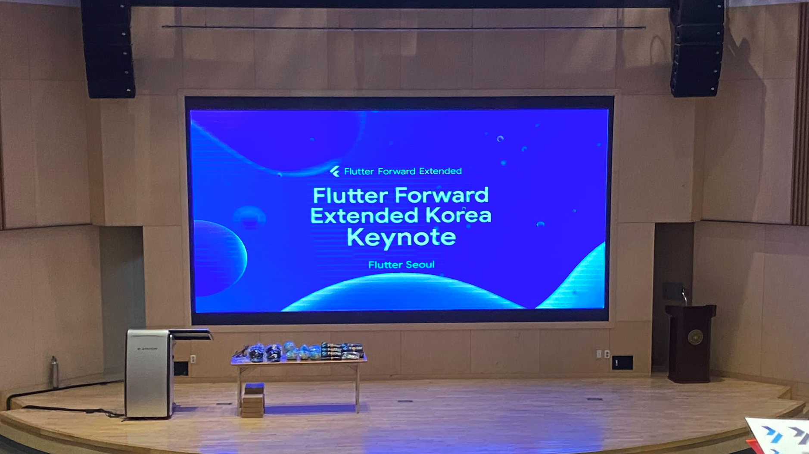
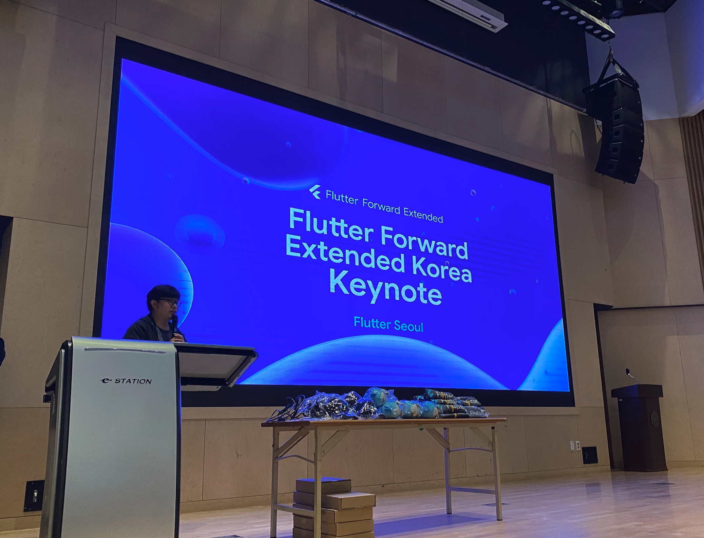

# Flutter Forward Extended Korea 특집

편집자: 홍종표, 박제창

Flutter Seoul 뉴스레터 구독자 여러분 안녕하세요! 👋

이번 23년 4월 1일(토) Flutter Forward Extended Korea 행사가 성공적으로 마무리되었습니다. 

참석하신 모든 분들께서 즐겁고 유익한 시간을 보내셨기를 바랍니다. 

이번 행사는 Flutter Forward 행사에서 다루었던 내용과 플러터와 관련된 최신 기술과 개발 경험을 공유하고, 플러터 개발자들 간의 교류를 이끌어내는 소중한 자리였습니다. 또한 Flutter 한국 커뮤니티(서울, 송도, 대구)분들이 함께 모여 준비한것에 의미가 깊은 행사였습니다. 

이번 행사를 통해 많은 지식과 인사이트를 얻으셨기를 바라며 이번 뉴스레터는 Flutter Forward 확장행사에 대한 특집호로 행사에 대한 전반적인 내용과 참석자 분들의 후기 그리고 발표자료에 대한 내용을 담았습니다. 

## 현장 스케치

**Keynote - 유병욱(Curogom)님, 박제창(Dreamwalker)님, 송승현님**

세 분이서 플러터 포워드 행사의 시작을 알려주셨습니다.

**Flutter 개발자라면 놓치면 안되는 Flutter Forward Contents - 유병욱(Curogom)**

Flutter Forward의 on-demand 컨텐츠에 대해서 GuroGom님이 선정한 컨텐츠를 들어 볼 수 있는 세션이었습니다. 

**Flutter Web 베스트 사용하기! & 개발자와 디자이너의 소통법 - Justin Ji, 신예은님**

Justin님께서는 Flutter 웹을 활용하여 만든 프로젝트들을 보여주시며, 플러터 웹의 특징을 소개해 주셨습니다.

디자이너 신예은님께서는 플러터 개발자들이 디자이너와 더 좋은 협업을 하기 위한 방법을 알려주셨습니다.

직접 pub.dev의 패키지들을 보며 더 빨리 개발할 수 있도록 디자인에 반영하는 부분은 모든 플러터 개발자들이 원하는 아주 인상적인 모습이었습니다.

**Flutter 2023 Roadmap - 박제창(Dreamwalker)님**

Flutter의 2023년 로드맵을 알아볼 수 있는 시간이었습니다. 

**Flutter로 앱 개발 입문하기 - 양수장님**

Flutter Songdo의 양수장님께서 연사자로 이번 행사를 함께 해주셨습니다. Flutter가 몸에 좋은 이유를 듣고 당장 Flutter를 적용해야겠는 마음이 들었던 세션이었습니다. 

**What’s new in Dart 3.0 - 홍종표(HDD)님**

Dart 3.0 새로운 문법에 대해 상세하게 알아볼 수 있는 시간이 었습니다. (Records&Patterns)

**Flutter에 Figma Variable Fonts 적용하기 - 정주영님**

Flutter Daegu의 정주영님께서 연사자로 함께해주셨습니다. Font variable에 대한 내용과 이를 Flutter에 적용하는 방법을 알아볼 수 있는 시간이었습니다. 

**flutter_naver_map 플러그인 리뉴얼 회고 - 김승빈님**

flutter_naver_map 플러그인 개발자의 회고를 들어볼 수 있는 시간이었습니다. 당일 naver_map 플러그인 개발자간의 역사적인 만남이 이루어진 순간이 있었습니다. 

---

## 발표자료 모음

| 세션명 | 발표자 | 자료링크 |
| --- | --- | --- |
| Flutter 개발자라면 놓치면 안되는 Flutter Forward Contents | 유병욱(CuroGom) | https://docs.google.com/presentation/d/1kERom75TGR2QP9cp89kcu1oAMimXqEOZ39EZFi3mG7M/edit?usp=sharing&resourcekey=0-I_u1deE5KkPhQXIjE9D24w |
| Flutter Web 베스트 사용하기!  | Justin Ji  | https://docs.google.com/presentation/d/1ASEnxc-vc7rrSbwfm61DUzu3xOcjOa0xGWq1F2eJD8M/edit?usp=sharing&resourcekey=0-E3n3_NTFdE0DmvYLTodeFQ  |
| 개발자와 디자이너의 소통법 | 신예은 | https://docs.google.com/presentation/d/15kTmkJ1yg9aGojTdBZm-hnfNwPjO-eDRv_Fcf4nN-TA/edit?resourcekey=0-ijGq2k_vbIy1Ne5gB3RzEg#slide=id.g2287c2aec1a_0_12 |
| Flutter 2023 Roadmap | 박제창 | https://docs.google.com/presentation/d/1M3qAwxk0ymO118jtUJeK1a6QyIgKP57_cE2ebUfghps/edit?usp=sharing |
| Flutter로 앱 개발 입문하기 | 양수장 | https://docs.google.com/presentation/d/1hS898FPI64WCLsG3U0glgt3UKJD2b2_yyBpKGu1BtO0/edit?usp=sharing&resourcekey=0-hUBL8VwRimmvPZ0uqMlucA |
| What’s new in Dart 3.0 | 홍종표 | https://docs.google.com/presentation/d/1dE_WSdPQvP-2Mclvf02WKlX3SqX44rC6xXlF_OexOdI/edit?usp=sharing |
| Flutter에 Figma Variable Fonts 적용하기 | 정주영 | https://docs.google.com/presentation/d/1zODKR_8sXLpTiYSVdwy2MDRZYx-kTjxnfVhjNvEj7ag/edit |
| flutter_naver_map 플러그인 리뉴얼 회고 | 김승빈 | https://docs.google.com/presentation/d/1264LEH6I5skA4BKm6kyWhcG7B0N0n4dQ-1_QRyfLMK0/edit?usp=sharing&resourcekey=0-IJvuGuq5kH4QEKuXa6vVfA |

---

## **설문 (일반 참가자 설문)**

우선 앞으로 더 좋은 발표를 할 수 있도록 설문을 작성해주신 모든 분들께 감사드립니다. 🙇‍♂️ 

**좋았던 점**

- 신입 개발자들에게는 너무나 소중하고 좋은 시간을 보냈어요.
- 발표자들의 세션이 퀄리티가 좋았어요. (+ 알찬 세션 콘텐츠)
- 네트워킹 시간을 통해 궁금증을 해소할 수 있었어요.
- 재밌었어요.
- 새로운 것을 많이 알 수 있었고 유익했어요.
- 플러터에 관해서 많은 정보를 알 수 있었어요.

**아쉬운 점**

- 굿즈의 배분이 아쉬웠어요.
- 잡페어의 부재가 아쉬웠어요.
- 간식이 빨리 떨어져서 아쉬웠어요.
- 질문 시간과 쉬는 시간이 짧았어요..
- 인터넷에서 접할 수 있는 정보를 다시 듣는 느낌이었어요.

**좋았던 점**은 강화하고, **아쉬운 점**은 보완해서 앞으로 더 좋은 행사를 개최할 수 있도록 노력하겠습니다!

---

## 스태프 & 연사자 후기 (설문)

당일 Flutter Seoul의 모든 운영진 분들이 함께 해주셨습니다. 함께해주신 모든 분들께 다시 한번 감사 인사드리며 스탭으로 참가해주신분들과 연사자로 참가해주신 분들의 후기를 솔직하게 담아보았습니다. 

### **스태프 후기**

- 항상 열심히 해주시는 다른 스태프분들 너무 감사하다고 말씀드리고 싶어요!
- 유튜브 송출은 정말 쉽지 않네요... 리허설 시간이 너무 촉박했던게 아쉽네요.
- 우여곡절 끝에 행사를 개최하고 마치게 되어 한시름 덜었습니다. 좋은 순간도 많았고 아쉬운 순간도 많았습니다. 아직까지는 부족한게 많은 행사였어서 앞으로 더 나은 개발자 포럼을 위해 노력해야겠다고 생각했습니다.
- 아쉬운 점 첫째도 리허설 둘째도 리허설 셋째도 리허설이었습니다. 중반 이후부터는 안정감을 찾았지만 초반에 리허설없이 행사가 시작되려니 예상하지 못한 이슈와 버그에 시달렸습니다. 특히나 본인이 장소대관업무를 맡았는데 장소 특성을 잘 몰랐던것에 반성하고 있습니다. 소프트웨어 엔지니어인데 예외 처리나 Hazard 시나리오를 전혀 구상 안 해본게 아쉬웠습니다. 굿즈 배분이나 리허설 등은 돌발상황이 특히나 많이 발생해서 예상 돌발상황이나 대처 방안, 그리고 컨트롤 타워로서 역할을 부족하게 한것 같아서 팀원들에게 미안했습니다.
- 작년에 이어 올해도 무사히 행사를 개최하여 기쁩니다! 저에게도 모두에게도 유익한 시간이었다고 믿고 있어요!!
- 행사에서 아쉬운 점은 없었지만 정말 최선을 다했습니다.

### 연사자 후기

- 발표 내용이 너무 평이했나 라는 생각이 좀 들긴 합니다. 조금 더 빡센 주제를 준비 했어야했나…
- 연사자로서 너무 감사하고 좋은 경험이였던 것 같습니다. 포항에서부터 멀리와서 피곤했었지만 그만큼 값지고 좋은 경험이었습니다 ㅎㅎ
- 많은 내용을 짧은 시간에 담으려고 하다보니 지나치게되는 내용들이 많아서 아쉬웠어요.
- 발표 자료를 시작전 미리 확인할 수 있는 시간이 적었던 것 같아요! 발표 도중에 Font가 살짝 밀려서 당황했었는데 다음에 미리 화면에 어떻게 보이는 지만 확인하면 좋을 것 같아요.
- 온라인 송출이 공개가 아니라서 조금 아쉬웠어요.
- 온라인으로만 발표를 진행해봤다가 오프라인으로 처음 하게되어 긴장도 많이되고, 부담감도 엄청 심했었는데 막상 하고 나니 온라인 발표보다 훨씬 재미있었습니다.
- 사람이 생각보다 많아서 좋았습니다! 플러터에 열정이 있는 사람이 이렇게나 많았다니..!!

---

# 마치며

이번 행사를 위해 많은 분들이 도움을 주셨습니다. 후원사 분들께 다시 한번 감사인사드립니다. 🙇‍♂️

Flutter Seoul에 대한 지속적인 관심과 참여에 진심으로 감사드리며 더욱 더 좋은 행사로 찾아뵐수있도록 하겠습니다. 앞으로도 많은 관심 부탁드립니다. 

Flutter Seoul 뉴스레터를 통해 여러분께 보다 더 가치 있는 Flutter 관련정보와 유용한 소식을 전달하고더 나은 뉴스레터를 제공하기 위해 끊임없이 노력하겠습니다. 언제나 여러분의 피드백과 의견을 적극 환영합니다! 
곧 발간할 뉴스레터 4호도 기대해주세요. 감사합니다.