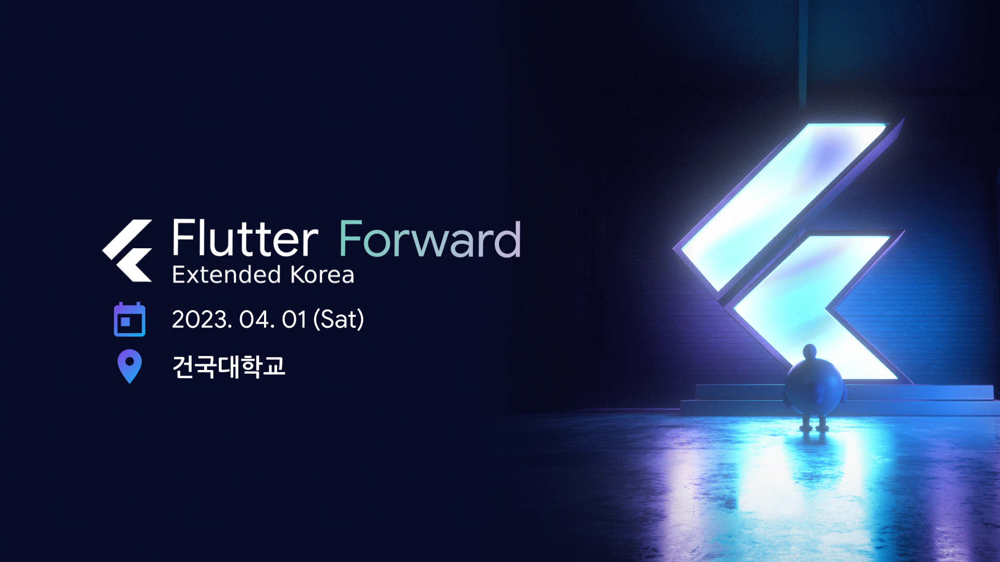
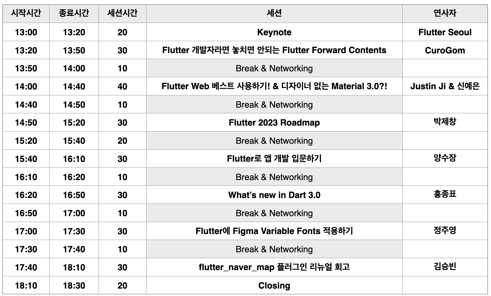
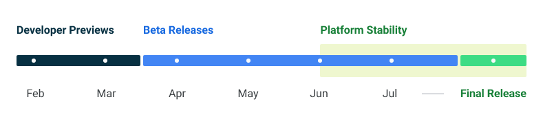
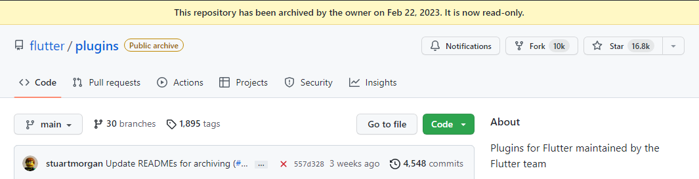

# 3회 (02/03 ~ 03/16)

안녕하세요? 플러터 서울 커뮤니티의 홍종표입니다.

이번 뉴스레터는 6주만에 만나뵙게 되었습니다. 😅

어느새 겨울이 끝이나고 봄이 왔습니다.  하지만 미세먼지와 꽃샘추위가 저희를 괴롭히고 있습니다.

지금까지 견뎌온 것처럼 미세먼지와 꽃샘추위도 이겨내고, 즐겁고 행복한 봄이되셨으면 좋겠습니다.

플러터 서울 커뮤니티에서는 **플러터와 관련된, 플러터 개발자를 위한 플러터 소식**들을 수집해서 정기적으로 뉴스레터를 발행할 계획입니다.

많은 관심 가져주시면 감사하겠습니다. 🙇‍♂️

---

# 1. 플러터 3.7 출시 이후 버전이 꾸준히 오르고 있습니다.

작성 : 홍종표(HDD), Jhin Lee(리핵)

핫픽스 설명: [https://github.com/flutter/flutter/wiki/Hotfixes-to-the-Stable-Channel](https://github.com/flutter/flutter/wiki/Hotfixes-to-the-Stable-Channel)

현재 최신버전: 3.7.7 (3월 9일 기준)

플러터팀의 철학은 매 분기마다 기능 업데이트를 포함해 Stable 채널을 업데이트하는 것이라고 합니다.

중간에 버그나, 회귀가 핫픽스 수정을 필요로 하는 경우가 있으며, 해당 버그를 수정하는 것이 또 다른 버그를 발생시킬 위험이 있기때문에 굉장히 보수적으로 접근한다고 합니다. 또한 Stable 채널은 가장 많이 테스트된 빌드를 나타내기를 원합니다.

플러터팀은 [flutter-announce](https://groups.google.com/forum/#!forum/flutter-announce) 그룹에 핫픽스를 발표하며, 플러터를 사용하신다면 해당 그룹에 가입하는 것을 추천드립니다.

최신 버전만 핫픽스를 적용하므로, stable의 이전 버전에서 버그가 발견된다면 해당 채널의 최신버전으로 업그레이드하는 것을 권장합니다.

# 2. 플러터 포워드 확장행사 홍보

2023년 4월 1일 
건국대학교 서울캠퍼스 제 1 학생회관 2층 프라임홀에서 플러터 포워드 한국 확장행사가 열립니다.

잡페어도 같이 열리니 많은 관심 부탁드리겠습니다.

[Flutter Forward Extended Korea | Festa!](https://festa.io/events/3201)

행사 내용

# 3. 안드로이드 14 개발자 프리뷰 출시

작성 : 박제창  

안드로이드 14 개발자 프리뷰가 발표되었습니다. 현재 개발자 프리뷰 2 버전이 출시되었습니다. 

자세한 내용은 [https://developer.android.com/about/versions/14](https://developer.android.com/about/versions/14) 에서 확인해 보실 수 있습니다. 

# 4. 팟케스트 1회 홍보 & 2회 예고

작성: 박제창

플러터 서울에서 처음으로 유튜브 플랫폼을 통해 팟케스트를 진행했습니다. 플러터 선술집은 플러터 서울의 팟케스트로 이는 편안한 분위기 속에서 플러터 개발자들이 모여 소소한 이야기를 하는 자리를 만들어보고자 하는 의미를 담고 있습니다. 첫회는 플러터 서울의 운영진 박제창, Curogom, 홍종표 이렇게 3명으로 시작을 알렸으며 뉴스레터 1~2호를 함께 읽어보는 시간을 가졌습니다.  앞으로 플러터와 관련된 다양한 주제로 만나요 ~ 

[Flutter Seoul 선술집 Vol. 1](https://www.youtube.com/watch?v=wDDTjARyuQ0)

# 5. 플러터 패키지 소식

작성: 홍종표, 박제창

### 5.1. Dio 5.0 업데이트 및 메인테이너 변경소식

[dio | Dart Package](https://pub.dev/packages/dio)

[Continuing the dio journey with CFUG team / 新的 dio 库维护团队 · Issue #1644 · cfug/dio](https://github.com/cfug/dio/issues/1644)

Riverpod의 Remi Rousselet 님께서 말씀하셨듯이 Dio의 메인테이너 변경 소식은 오픈소스의 죽음을 두려워하지 않아도 되는 좋은 예라고 생각합니다.

### 5.2. Riverpod 관련 업데이트

1. Riverpod 2.3.0 마이너 업데이트 (현재 2.3.2)
    
    [flutter_riverpod | Flutter Package](https://pub.dev/packages/flutter_riverpod)
    
2. Riverpod Lint 출시 (현재 1.1.6)
    
    [riverpod_lint | Dart Package](https://pub.dev/packages/riverpod_lint)
    
3. Riverpod Generator 2.0.0 메이저 업데이트 (현재 2.1.4)
    
    [riverpod_generator | Dart Package](https://pub.dev/packages/riverpod_generator)
    
4. Riverpod annotation 2.0.0 메이저 업데이트 (현재 2.0.2)

### 5.3. GoRouter 6.2.0 마이너 업데이트

[go_router | Flutter Package](https://pub.dev/packages/go_router)

### 5.4. flutter/plugins → flutter/package로 이동

Flutter 팀에서 관리하는 플러그인 리포지토리(flutter/plugins)가  플러터 패키지 리포지토리(flutter/package)로 이관되었습니다. 

# 6. 플러터 코드푸시

작성: 홍종표, 박제창

플러터에서 코드푸시의 가능성이 열렸다?

플러터 & 다트 오픈소스를 많이 만들어내신 전 Very Good Ventures 수석 엔지니어님과 Google의 플러터 & 다트 엔지니어링 이사를 맡으셨던 분들이 코드푸시 기능에 대한 프로젝트를 진행 중 입니다.

[Shorebird](https://shorebird.dev/)

[Code Push for Flutter - Shorebird](https://youtu.be/mmKvs0_Zu14)

# 7. 23년 Google I/O가 개최 될 예정입니다.

구글의 개발자 컨퍼런스인 Google I/O가 23년 5월 10일 개최됩니다. 올해도 다양한 구글 프로덕트에 대한 발표가 기대됩니다. 

[https://io.google/2023](https://io.google/2023/intl/ko/)

[Google I/O 2023](https://io.google/2023/puzzle/)

---

**Flutter Seoul 뉴스레터 구독하기**

Flutter Seoul 의 뉴스레터 구독을 원하시는 분들은 해당 레포지터리의 `watch` 눌러 구독하실 수 있습니다.

👉  [플러터 이슈 기고란](https://docs.google.com/forms/d/1P58z7f_YC-BJehHW3xa2dp1impmFwrmEhOJUTDVfWPo/edit)

👉  [플러터 뉴스레터 3회 피드백](https://forms.gle/DgNTdD8Q4p4Gj7dZ7)

---

플러터 서울 공식 트위터: [@FlutterSeoul](https://twitter.com/flutterseoul?s=21&t=1lvvhkp7LX_b-JT8sVoYCA)

플러터 서울 공식 디스코드: [https://flutter-seoul.com](https://flutter-seoul.com)

플러터 서울 공식 밋업: [https://meetup.flutter-seoul.com](https://meetup.flutter-seoul.com)