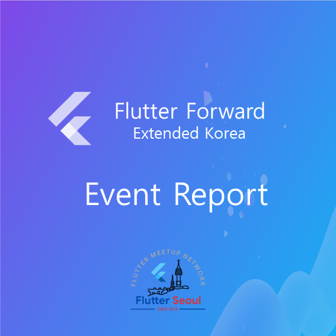
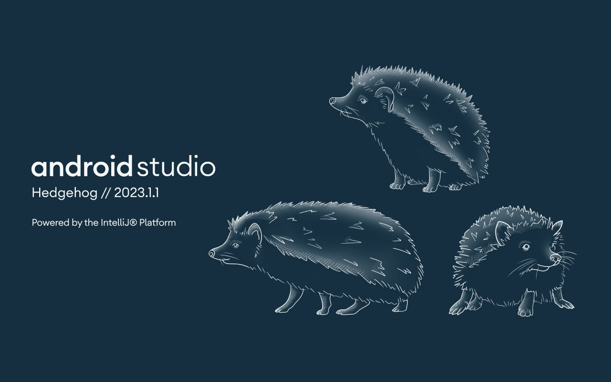

# 4회  (04/09 ~ 05/04) 05/04 발행

안녕하세요? 플러터 서울 커뮤니티의 홍종표(HDD), 박제창(Dreamwalker)입니다. 

5월 첫째주는 월요일에는 근로자의 날이 있었고, 다가올 금요일에는 어린이날있는 연휴 많은 행복한 한 주 입니다.

즐거운 휴가기간에 모두 아프지않고 행복한 가정의 달되셨으면 좋겠습니다.  

# 1. Flutter Forward 한국 확장행사가 마무리 되었습니다.

기다리시던 Flutter Forward 한국 확장행사 영상들이 Flutter Korea 유튜브 업로드 되었습니다.

아쉽게 행사를 놓치신 분들은 유튜브를 통해서 다시 보실 수 있습니다. 

구독👀 .. 좋아요👍 .. 알림설정🔔 부탁드립니다.
(팟캐스트 때 알림 받을 수 있어요!)

[Flutter Korea](https://www.youtube.com/@flutterkorea)

이벤트 결과를 보고 싶으신 분은 👇 링크를 통해 확인하실 수 있습니다.

[Flutter Seoul on Twitter](https://twitter.com/flutterseoul/status/1654047099946946560?s=61&t=f7KwF7aU9uQhnu-Z0C6KLQ)

# 2. 플러터 SDK 및 패키지 소식

## 2.1.  플러터 3.7.x 업데이트

뉴스레터 3회 기준 3.7.7 버전에서 4월 19일 기준 3.7.12 버전으로 업그레이드 되었습니다.
업데이트에 대한 자세한 내용은 아래의 링크를 통해 확인 부탁드립니다.

[Hotfixes to the Stable Channel](https://github.com/flutter/flutter/wiki/Hotfixes-to-the-Stable-Channel)

## 2.2.  GoRouter 7.0 Major 업데이트

GoRouter의 6.5.0 마이너 업데이트에서는 반가운 기능이 추가되었습니다.

기존의 Navigator를 통해 push, pop 메소드를 사용할 때 처럼 GoRouter의 push 메소드를 사용할 때 결과값을 전달 받을 수 있게 변경되었습니다. 👍

GoRouterBuilder 패키지 또한 returning value이 바로 지원이 되지는 않았지만
4월 22일 기준으로 1.2.2 버전이 되며 해당 기능을 지원할 수 있게 되었습니다.

저를 포함해 많은 분들이 굉장히 바라던 기능이 추가된 만큼, GoRouter를 더 잘 쓸 수 있게 되었습니다. 

현재의 GoRouter는 7.0 메이저 업데이트가 되었습니다.

큰 변화는 아니지만 GoRouterState 및 GoRouter 클래스의 필드, 메소드 파라미터 등이 변경이 되며 Breaking change가 생겨 7.0.0이 되었습니다.

5월 2일 기준 GoRouter Builder는 아직 7.0 버전에 맞게 마이그레이션 되지않았기때문에 같이 사용하고 계신 분들은 조금 기다렸다가 올리시는걸 추천드립니다.

[go_router | Flutter Package](https://pub.dev/packages/go_router)

[go_router_builder | Dart Package](https://pub.dev/packages/go_router_builder)

## 2.3. webview_flutter 4.2.0 패키지 마이너 업데이트

한동안 조용했던 WebivewFlutter Package가 업데이트 되었습니다.

4.1.0 버전에서는 최소 Flutter Version이 3.3으로 오르며 URL 변경을 추적하는 `NavaigationDelegate(onUrlChange)` 기능이 새로 생겼습니다.

4.2.0 버전에서는 권한을 요구할 수 있는 `WebviewController(onPermissionRequest)` 기능이 추가되었습니다.

공식 웹뷰 플러그인의 경우 ****[flutter_inappwebview](https://pub.dev/packages/flutter_inappwebview)** 패키지와 함께 양대산맥으로 많이 쓰이는 웹뷰 플러그인인데요. 점점 더 편하고 잘 사용할 수 있도록 변하는 모습이 보기 좋습니다. 👍

[webview_flutter | Flutter Package](https://pub.dev/packages/webview_flutter)

## 2.4. Dart Dev Channel 및 DartPad Master Channel 업데이트

Dart Dev 채널의 버전이 3.1.0 으로 올라갔습니다.
Google I/O 에서 Dart 3.0의 출시가 확실한 것 같습니다 (HDD 추측 🤔)

DartPad의 Master Channel 또한 Flutter 3.10.0 & Dart 3.1.0으로 올라갔습니다.

추가적인 변경사항으로는 시험적 기능으로 inline-class를 사용해 볼수 있습니다.
 

# 3.  Flutter Seoul x MODUPOP

지난 4월11일, 18일 2회에 거쳐 모두의연구소 모두팝과 Flutter Seoul이 콜라보한 세미나가 있었습니다. 

## 3.1. **Flutter 2023년 전략과 로드맵**

2023년 04월 11일(화) 모두의연구소 강남캠퍼스에서 플러터 2023년 전략과 로드맵 발표가 있었습니다.

플러터 서울의 박제창님께서 플러터가 무엇인지, 2023년 플러터 전략과 엔지니어링 로드맵에 대한 내용을 주제로 발표해주셨습니다. 

플러터 2023년 로드맵은 [위키](https://github.com/flutter/flutter/wiki/Roadmap), [미디엄](https://medium.com/flutter/flutter-in-2023-strategy-and-roadmap-60efc8d8b0c7) 에서 확인해보실 수 있습니다. 

행사 당일 발표자료는 [여기](https://speakerdeck.com/itsmedreamwalker/flutter-2023-jeonryaggwa-rodeumaeb-bagjecang-at-modupop)에서 확인해 보실수 있습니다.

## 3.2. **Anatomy of Riverpod**

2023년 04월 18일(화) 모두의연구소 강남캠퍼스에서 Anatomy of riverpod이라는 발표주제를 가지고 플러터서울의 박제창님께서 발표해 주셨습니다. 

세미나 당일에는 Riverpod 패키지에 대한 소개와 플러터 상태관리에 기본적인 내용을 배울 수 있는 자리였습니다. 

발표자료는 [여기](https://speakerdeck.com/itsmedreamwalker/anatomy-of-riverpod-bagjecang-at-modupop)에서 확인해 보실수 있습니다.

# 4. Google I/O 2023

5월 10일에 있을 I/O 프로그램이 공개되었습니다! 

[Google I/O](https://io.google/2023/program/intl/ko/?q=flutter)

- 초급
    - [머티리얼 디자인에 관한 새로운 소식](https://io.google/2023/program/630ffaa3-9b3d-4e30-a89f-91ef3e8052cf/intl/ko/)
    - [Dart 및 Flutter에 관한 새로운 소식](https://io.google/2023/program/7a253260-3941-470b-8a4d-4253af000119/intl/ko/)
    - [Flutter 및 머티리얼 3를 사용하여 모든 기기를 지원하도록 디자인](https://io.google/2023/program/3a895611-42dc-4735-8ff5-7c759a1ced34/intl/ko/)
    - [Firebase의 Flutter SDK에 관한 새로운 소식](https://io.google/2023/program/16cd0363-98fa-4f1e-86f6-94268beef641/intl/ko/)
    - [Dart에서 패키지 빌드하기](https://io.google/2023/program/4fc92976-a6da-49a8-904e-16386210eb62/intl/ko/)
- 중급
    - [Flutter 딥 링크 심층 분석](https://io.google/2023/program/7a2f7209-f82e-44c6-a9a6-661f3d4e97dc/intl/ko/)
    - [Flutter의 웹 지원 개선](https://io.google/2023/program/a90c5bde-d0d0-484e-b1c3-86f5224bdcc8/intl/ko/)
- 고급
    - [Android와 Dart와의 상호운용성 재구상](https://io.google/2023/program/2f02692d-9a41-49c0-8786-1a22b7155628/intl/ko/)
    - [Flutter, Dart, 그리고 Raspberry Pi](https://io.google/2023/program/b21c56db-9cd5-46d8-8ea5-ea2c26ccc249/intl/ko/)
    - [Impeller 투어 - Flutter의 새로운 렌더링 엔진](https://io.google/2023/program/60b4bd9e-4159-473d-b031-edabb93d0e00/intl/ko/)
    - [Flutter에서 차세대 UI 구축](https://io.google/2023/program/37d7aabe-46e4-4fdf-a2b8-4f065daf95a9/intl/ko/)

# 5. Flutter Seoul 커뮤니티의 오픈 카카오톡 채팅방 개설

디스코드가 상대적으로 접근성이 떨어져서 플러터 서울 커뮤니티의 소식들을 챙겨보기가 힘드셨다면, 좀 더 접근성 높은? 오픈 카카오톡 채팅방을 통해 챙겨들으실 수 있습니다.

오픈 카카오톡 채팅방도 좋지만, 디스코드에서 많은 활동 및 관심 부탁드립니다 🙇‍♂️

[Flutter-Seoul](https://open.kakao.com/o/gdL2Gj1e)

# 6. Android Studio 업데이트 소식

## 6.1. Android Studio Flamingo 정식 버전 출시

안드로이드 스튜디오 플라밍고가 stable 버전이 되었습니다.

사실 Flutter만 개발하면 크게 변경사항을 체감할 수 없긴하지만, 출시되었습니다..! 😅

[Android Studio Flamingo is stable](https://android-developers.googleblog.com/2023/04/android-studio-flamingo-is-stable.html)

## 6.2.  Android Studio Hedgehog 카나리 버전 출시

Android Studio 프리뷰 버전 Hedgehog가 공개되었습니다.  

# 7. ****shorebird 코드푸시 베타 공개****

현재는 Android 플랫폼 한정이지만 Flutter에서 Code Push를 가능하게 해주는 도구,  ShoreBird가 Open Beta로 공개되었습니다.

iOS 및 Desktop도 지원 예정이지만 시작은 Android로 할 예정이라고 합니다.

[Felix Angelov 🐦💙 on Twitter](https://twitter.com/felangelov/status/1653163477576433664?s=61&t=IJnSijijWR2MpeM0wiIKKg)

---

**Flutter Seoul 뉴스레터 구독하기**

Flutter Seoul 의 뉴스레터 구독을 원하시는 분들은 해당 레포지터리의 `watch` 눌러 구독하실 수 있습니다

---

플러터 서울 공식 트위터: [@FlutterSeoul](https://twitter.com/flutterseoul?s=21&t=1lvvhkp7LX_b-JT8sVoYCA)

플러터 서울 공식 디스코드: [https://flutter-seoul.com](https://flutter-seoul.com)

플러터 서울 공식 오픈 카카오톡: [참여하기](https://open.kakao.com/o/gdL2Gj1e)

플러터 서울 공식 밋업: [https://meetup.flutter-seoul.com](https://meetup.flutter-seoul.com)