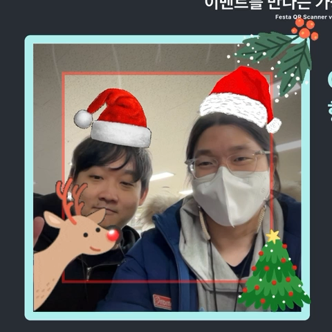

# Flutter Seoul Newsletter 8호

안녕하세요? 플러터 서울 커뮤니티의 홍종표(HDD), 박제창(Dreamwalker)입니다. 

다들 23년 잘 보내셨나요? 어느새 벌써 12월이 되었고, 날씨가 급격하게 추워졌습니다. 따뜻하게 건강 관리 잘 하시고 남은 연휴 잘 마무리 하셨으면 좋겠습니다. 😄

그럼 뉴스레터 8호 시작합니다. 

---

# 1. Flutter 3.16, Dart 3.2 업데이트

11월 16일에 Flutter 3.13.x → 3.16.0, Dart 3.1.x → 3.2.0 으로 마이너 업데이트가 있었습니다.

현재는 가장 최신 버전은 Flutter 3.16.5 , Dart 3.2.3 입니다.

마이너 업데이트에 대한 확인은 아래 블로그 들을 참고하시면 됩니다. 

👉 [**What’s new in Flutter 3.16**](https://medium.com/flutter/whats-new-in-flutter-3-16-dba6cb1015d1)

👉 [**Announcing Dart 3.2**](https://medium.com/dartlang/dart-3-2-c8de8fe1b91f)

패치 업데이트에 대한 내용은 Flutter 레포의 Hotfixes to the Stable Channel을 참고하시면 됩니다.

👉 [**Hotfixes to the Stable Channel**](https://github.com/flutter/flutter/wiki/Hotfixes-to-the-Stable-Channel)

12월 5일에 Flutter 3.18 beta 버전도 릴리즈되었습니다.

혹시 추후에 나올 변경사항들이 궁금하다면 아래 Releases Note를 추천드립니다.

👉 [**Flutter 3.18 beta (December 5, 2023)**](https://github.com/flutter/flutter/releases/tag/3.18.0-0.1.pre)

# 2. **Majid Hajian - Flutter 또는 Dart를 사용하는 회사, 팀 리스트 수집**

플러터 커뮤니티의 리더로 활동하고 계신 **Majid Hajian** 님께서 링크드인 등 다양한 플랫폼에서 Flutter를 사용하는 많은 회사와 앱을 알고있으며, 해당 글을 통해 Flutter와 Dart를 사용하는 회사, 팀에 참고할 수 있는 자료로 만들기 위해 앱/회사이름을 댓글로 남겨 목록을 만들고 있다고합니다.

약 200개 정도의 댓글이 있는데 어떤 회사들이 Flutter와 Dart를 사용하는지 확인해보는 것도 좋을 것 같습니다.

👉 [**Linked in 링크**](https://www.linkedin.com/posts/mhadaily_flutter-activity-7133022094346338304-oZTw?utm_source=li_share&utm_content=feedcontent&utm_medium=g_dt_web&utm_campaign=copy)

# 3. 알아두면 쓸데없는 신기한 Dart Library

### 3.1. [pharaoh](https://pub.dev/packages/pharaoh)

지난 뉴스레터에서도 dart 언어로 작성된 서버 프레임워크를 소개 드렸는데요. 이번에도 또 새로운 다트의 서버 프레임워크가 나왔다고 합니다.

새로운 개념이 있는 서버 프레임워크는 아니며, 더 표현력이 뛰어나다고 합니다. 여러 서버 프레임워크를 경험해보신 분이라면 한번 찍어먹어 보는 것도 좋을 것 같습니다.

👉 [깃허브 레포지터리](https://github.com/codekeyz/pharaoh)

### 3.2 [rust_core](https://pub.dev/packages/rust_core)

Dart로 프로그래밍하는 Rust 개발자 혹은 안전한 프로그래밍에 관심이 있는 Dart 개발자를 위해 
Dart에서 Rust 핵심 라이브러리를 구현한 패키지 “rust_core”를 개발했다고 합니다.

`Result` `Option` `Cell` `OneCell` `LazyCell` 등등 구현되었다고 합니다.

👉 [깃허브 레포지터리](https://github.com/mcmah309/rust_core)

👉 [관심있는 사람들을 위한 링크](https://github.com/mcmah309/rust_core/tree/master/lib/src/result#dart-equivalent-to-the-rust--early-return-operator)

### 3.3 [app_upgrader](https://pub.dev/packages/app_upgrader)

많은 분들이 버전 체크를 통해 업데이트 안내를 해줄 때 기존에 [upgrader](https://pub.dev/packages/upgrader) 패키지를 많이 사용하셨을 것 같습니다.

해당 패키지는 로컬에서 테스트가 가능하며 json 에 기록하는 것으로 중간 버전만 강제 업데이트를 할 수 있도록 지원하기도 합니다.

# 4. Flutter Seoul 관련 행사들

연말에는 개발자 행사의 풍년이 었는데요. 우리 플러터 서울도 많은 행사에 함께 했습니다. 11월 ~ 12월 동안 Flutter Seoul 운영진분들이 함께 행사를 가꾸어가고 Staff & Speaker로써 참여한 행사입니다. 

### 4.1 **Flutter Developer Meetup - Seoul**

11월 10일 Flutter Seoul에서 주최하는 퇴근길 밋업 행사가 열렸었습니다. 

이벤트 링크: [https://festa.io/events/4202](https://festa.io/events/4202)

행사 당일에는 모든 플러터 서울 운영진분께서 함께 수고해주셨습니다. 많은 플러터 개발자 분들이 함께해주셔서 다시한번 감사인사 드립니다. 앞으로도 간단하게라도 종종 네트워킹을 할 수 있는 자리를 마련할 수 있도록 하겠습니다. 꾸준한 관심 부탁드립니다. 

### 4.2 MADC (**Mobile App Developer's Conference**)

일시: 2023년 12월 02일 (토) 오후 01:00 - 오후 07:00

장소: 건국대학교 학생회관

이벤트 링크: [https://festa.io/events/4182](https://festa.io/events/4182)

Flutter Seoul의 송승현님, 박제창님이 운영위원회로 참여하셨고, 홍종표님께서는 일일 스태프로 함께 참여해주셨습니다. 

Flutter Seoul 외에도 GDG, GDE 등 여러 커뮤니티에서 함께 운영위원회로 모여 주최한 뜻깊은 행사였습니다. 

앞으로도 계속 모바일 개발자들이 모여 대화 나눌 수 있도록 행사를 만들어나갈 예정이라고 합니다.

### 4.3 Devfest Songdo 2023

일시: 2023년 12월 10일 (일) 오후 01:00 - 오후 07:00

장소: 송도 컨벤시아

이벤트 링크: [https://festa.io/events/4246](https://festa.io/events/4246)

행사 당일에는 Flutter Seoul의 박제창님, 송승현님, 유병욱님께서 연사로 참여해주셨습니다. 

박제창 - Dart Interoperability Part.1

👉 [발표 자료](https://speakerdeck.com/itsmedreamwalker/devfest-2023-songdo-dart-interoperability-part-dot-1-bagjecang)

송승현 - 초고화질 이미지 1000개 씩 아무튼 렉 없이 빠르게 표시해주세요 - Flutter에서 이미지 다루기 중급편

유병욱 - Flutter에 Rive를 얹어 다양한 플랫폼의 애니메이션 만들기

# 5. 12월의 Medium Stories (발라스님)

### 5.1 [Flutter Taipei의 Monthly Newsletter](https://medium.com/flutter-taipei/flutter-november-2023-flutter-monthly-f58c8f9c7dcd)

Flutter Taipei 커뮤니티에서도 월간 뉴스레터를 발행하는 것 같습니다.

내용을 살펴봤는데 정말 많은 내용들이 담겨있는 것 같습니다.

저희 월간 뉴스레터도 더 많은 내용을 담을 수 있도록 노력하겠습니다! 💪

### 5.2 **[Flutter Interview Questions and Answers: Top 30 for Pros!](https://medium.com/@flutterwtf/flutter-interview-questions-and-answers-top-30-for-pros-0cdbf1d40ebd)**

면접관이 프레임워크에 대한 친숙도와 관계없이 지원자를 종합적으로 평가할 수 있도록 적합한 질문 샘플들을 제공한다고 합니다.

면접을 앞두고 계신 면접관, 지원자 모두 관련 글을 보면 도움이 될 것 같습니다.

### 5.3 **[Why does Flutter perform better than other cross-platform tools?](https://medium.com/@moriryosuke48/why-does-flutter-perform-better-than-other-cross-platform-tools-24a90c7bf42a)**

Flutter가 다른 크로스플랫폼보다 좋은 이유가 무엇일까요?

*주의 실제로 측정한 것이 아니라 Flutter 개발팀의 주장.

# 6. Hixie (Flutter Co-founder, TeamLeader) Google을 떠나다.

18년간 구글에서 일하셨던 Flutter Techlead Hixie님께서 구글을 퇴사하셨다고 합니다.

다만 Flutter는 오픈소스이기때문에 여전히 풀타임으로 일할 것이라고 합니다.

👉 **[The Future is Flutter](https://ln.hixie.ch/?start=1700627532&order=-1&count=1)**

👉 [**Reflecting on 18 years at Google**](https://ln.hixie.ch/?start=1700627373&count=1)

▶️ **[Reflecting on Hixie (Flutter Co-Founder & Tech Lead) leaving Google](https://www.youtube.com/watch?v=UXRj4cFwQrA)**

---

내년에도 뉴스레터 발행은 계속되오니 많은 관심 부탁드립니다 올 한해도 뉴스레터를 구독하고 읽어주셔서 감사합니다. 

홍종표, 박제창 드림 

---

**Flutter Seoul 뉴스레터 구독하기**

Flutter Seoul 의 뉴스레터 구독을 원하시는 분들은 해당 레포지터리의 `watch` 눌러 구독하실 수 있습니다

---

플러터 서울 공식 트위터: [@FlutterSeoul](https://twitter.com/flutterseoul?s=21&t=1lvvhkp7LX_b-JT8sVoYCA)

플러터 서울 공식 디스코드: [https://flutter-seoul.com](https://flutter-seoul.com)

플러터 서울 공식 오픈 카카오톡: [참여하기](https://open.kakao.com/o/gdL2Gj1e)

플러터 서울 공식 밋업: [https://meetup.flutter-seoul.com](https://meetup.flutter-seoul.com)
