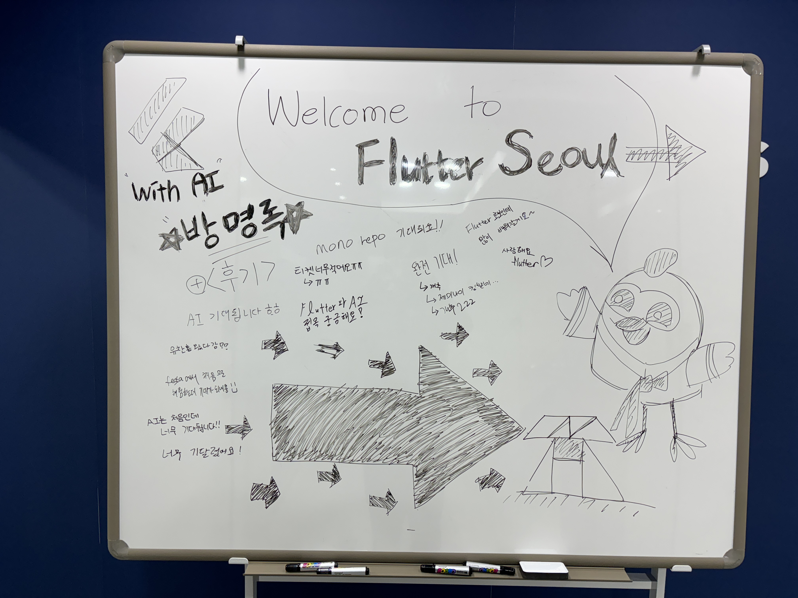
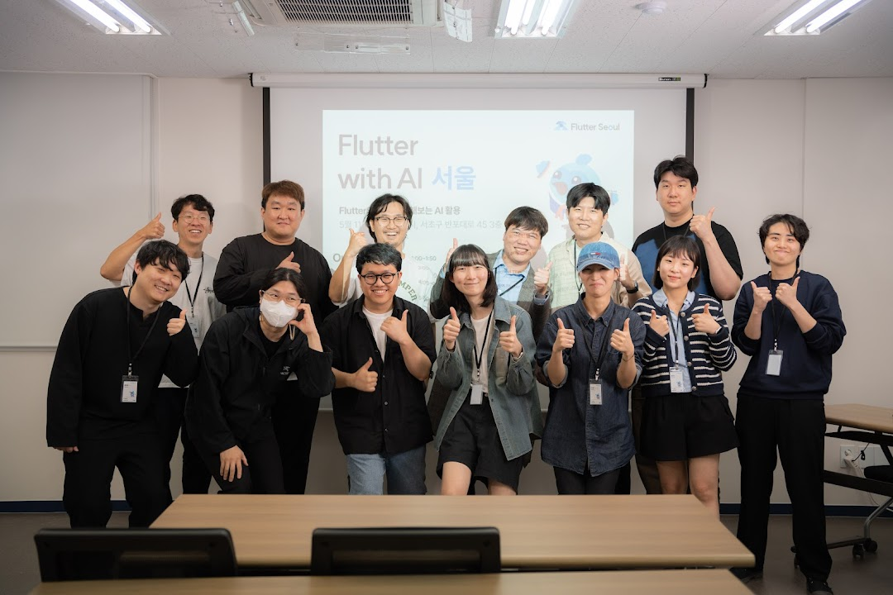
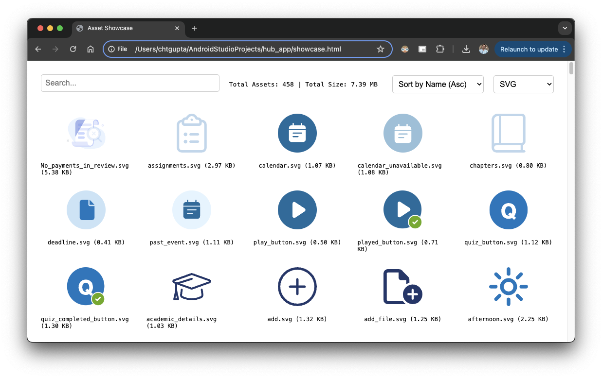

# Flutter Seoul Newsletter 13호

Flutter Seoul Newsletter 13호를 확인해주셔서 감사합니다.

플러터 서울 커뮤니티의 홍종표(HDD)와 박제창(Dreamwalker)입니다.
어느덧 2024년 상반기가 저물고 5월이 지나 여름이 다가오고 있습니다. 이번 달에는 근로자의날과 어린이날과 그리고 부처님 오신날까지 있어 휴일이 많아 즐거운 시간을 보낼 수 있었습니다.
다가오는 6월 여름도 즐겁고 행복한 시간 보내시길 바랍니다.

이번 호에서는 다음과 같은 내용을 다룹니다.

- Flutter SDK 3.22 업데이트 소식
    - Dart 3.4
    - Flutter 3.22
- Flutter Seoul 행사 (Flutter with AI)
- All the Flutter news from a busy Google I/O 2024
- ServerPod 2.0, “**Dreamscape”** 출시
- Dart/Flutter Library
- Announcing the winners of the Global Gamers Challenge
- Gemini API 개발자 대회

---

# 1. Flutter SDK 3.22 업데이트 소식

5월 15일 Google I/O 2024 에서 Flutter 3.22 와 Dart 3.4 가 공개되었습니다.

## Dart 3.4

Dart 3.4 버전을 소개하는 글에서는 **WebAssembly, Dart macros** 두 기능에 대해 집중적으로 소개합니다.

### **1. WebAssembly**

최신 플러터 버전인 3.22 에서 Flutter 웹앱에 WebAssembly (Wasm)을 완벽하게 지원하게 되었다고 합니다. 다음 노력으로는 순수한 Dart 앱에서도 Wasm을 완벽하게 지원하고, 몇가지 누락된 기능(예를 들어defferred loading)을 보완하는 것이라고 합니다.

### **2. Dart macros**

매크로는 코드 생성과 같은 메타 프로그래밍 솔루션을 제공하며 Dart 언어 개발환경을 개선한다고 합니다.

개발자에게 최고의 성능, 효율성 및 생산성을 제공하기 위해 Dart에 내장되어 있으며 프리뷰를 제공할 준비가 되었다고 합니다.

Dart 개발자들은 사소하지만 지루한 Json 직렬화/역직렬화에 오랜 시간 고통을 받았는데 그것을 해결해주는 JsonCodable 매크로를 공개 했습니다.

그 외에 장기적인 목표는 커뮤니티가 자체 매크로를 만들어 Dart 프로그래밍의 추상화 수준을 높이는 것이라고 합니다. 

## Flutter 3.22

### **1. WebAssembly**

3.22 버전이 출시되면서 성능이 크게 향상되었다고 합니다.

M1 Macbook의 Chrome을 사용한 내부 벤치마크에서 앱 프레임 렌더링 시간은 평균 2배, 최악의 시나리오에서는 최대 3배까지 향상되었다고 합니다.

### **2. Engine**

Flutter의 렌더링 엔진인 Impeller 에 중요한 업데이트가 있었습니다.

Android 용 Vulkan 백엔드 기능이 완성되었다고 하며 3.22 버전에서 Impeller를 사용하는 경우 가능하다면 Vulkan 백엔드를 사용하게 되고 지원하지 않는 기기라면 Skia와 Open GL ES를 사용하게 된다고 합니다.

### **3. Framework**

Flavor 에 따라 조건부로 에셋 번들링 기능과 Dart 패키지를 사용하여 Asset 변환이 가능하도록 업데이트 되었다고 합니다.

이 외에도 많은 업데이트 내용들이 있습니다. 더 궁금하시다면 아래 문서들을 추천드립니다.

👉 [**Announcing Dart 3.4**](https://medium.com/dartlang/dart-3-4-bd8d23b4462a)

👉 [**Landing Flutter 3.22 and Dart 3.4 at Google I/O 2024**](https://medium.com/flutter/io24-5e211f708a37)

👉 [**What’s new in Flutter 3.22**](https://medium.com/flutter/whats-new-in-flutter-3-22-fbde6c164fe3)

# 2. Flutter Seoul 행사 소식 (Flutter with AI)

👉  [Festa 행사 페이지 보러가기](https://festa.io/events/5090)

이번달 5월 11일 토요일 Flutter Seoul에서 **Flutter with AI 2024 Seoul: Flutter와 함께 시작하는 AI 활용** 행사를 열었고 많은 분들이 참석해 주셨습니다. 참석해주신 분들께 다시 한번 감사의 인사드립니다.

이번 행사는 **올해 Flutter Seoul의 신규 오거나이저 분들께서 많은 활약해 주셨습니다.** 앞으로도 많은 관심 부탁드립니다.  

# 3. **All the Flutter news from a busy Google I/O 2024**

- 안드로이드 팀과 파트너십을 맺고 프로젝트에 적합한 프레임워크(플러터, 제트팩 컴포즈, 코틀린 멀티 플랫폼)를 선택하는 방법에 대한 안내를 제공하는 블로그 게시물을 작성했습니다.
- Google I/O 메인 행사에서는 다트와 플러터에 대한 흥미로운 토픽들이 소개되었습니다. 먼저 새로운 기능 in 플러터 키노트부터 시작한 다음 CameraX, 적응형 UI, AI 에이전트, 제미니, 앱 심층 링크와 같은 주제를 다루는 5개의 기술 세션으로 넘어가는 것이 좋습니다.
- 또한 캐주얼 게임을 플러터로 만드는 데 중점을 둔 3개의 새로운 코드랩이 있습니다. 2D 물리학 및 사운드 & 음악 추가를 시작하는 데 도움이 될 수 있습니다. 더 자세한 내용은 새로운 2D 물리 게임 워크샵을 확인하세요.
- I/O 연결 이벤트: Google I/O는 미국 캘리포니아 마운틴뷰의 쇼어라인에서 열린 주요 행사로 끝나지 않았습니다. 전 세계적으로 여러 Google I/O 커뮤니티 이벤트가 있으며, 세 곳에서 Google I/O Connect 이벤트가 계획되어 있습니다.

👉 [**All the Flutter news from a busy Google I/O 2024**](https://medium.com/flutter/all-the-flutter-news-from-a-busy-google-i-o-2024-7c963c064f8d)

# 4. ServerPod 2.0, “**Dreamscape”** 출시

### ServerPod 이란

오픈 소스 확장가능한 앱 서버로 Flutter의 원활한 경험을 서버에서도 느낄 수 있도록 설계되었습니다.

개발자는 서버와 클라이언트 사이에서 코드를 공유하며 개발을 간소화하고 생산성을 높일 수 있도록 전체 스택에서 Dart 언어를 사용할 수 있습니다.

### **Serverpod 2.0: Dreamscape**

Serverpod 2.0인 DreamScape는 커뮤니티 피드백을 기반으로 몇가지 중요한 개선 사항과 새로운 기능을 제공합니다.

1. **Serverpod mini**: 보다 더 간단한 버전에 대한 수요에 응답하여 간소화된 미니 버전을 소개했었습니다.
더 쉽게 설정하고 배포가 가능하며, 단일 명령으로 언제든지 Serverpod으로 업데이트가 가능 합니다.
2. **데이터베이스 관계 및 마이그레이션**: Type-Safe한 Dart 코드로 복잡한 데이터베이스 관계를 관리할 수 있습니다. 일대일, 다대일, 다대다 관계를 지원합니다.
3. **향상된 도구**: 대폭 개선된 명령줄 인터페이스, 실시간 피드백을 위한 새로운 VS Code 확장 프로그램, 그리고 더 나은 오류 메시지가 제공됩니다
4. **안정성 및 테스트**: 3000개 이상의 자동화된 테스트를 통해, 서버포드 2.0은 안정적이고 신뢰할 수 있는 개발 경험을 제공합니다.
5. **미래 보장**: Dreamscape는 기존 코드를 깨지 않고 미래 업데이트를 수용할 수 있도록 설계되었습니다.

### **Serverpod Cloud**

서버를 클라우드에 배포하는 것은 어려울 수 있습니다. 이 프로세스를 간소화하기 위해 Serverpod에서 Serverpod Cloud를 발표하게 되었으며 올 여름에 공개 베타 버전으로 출시될 예정이며, 가을에는 전체 출시가 예정되어 있다고 합니다.

자세한 내용은 미디움 블로그 및 유튜브 영상을 확인하세요.

👉 [**Serverpod 2.0, “Dreamscape” — Introducing Serverpod Cloud**](https://medium.com/serverpod/serverpod-2-0-dreamscape-introducing-serverpod-cloud-05b108c9aabf)

**▶️ [Serverpod 🚀 2.0 Release Keynote - Dreamscape](https://www.youtube.com/watch?v=F7WKovEFdnw)**

# 5. Dart/Flutter Library

### **1. [asset_showcase](https://pub.dev/packages/asset_showcase)**

지정된 디렉토리에 있는 에셋에 대한 쇼케이스를 생성해주는 Dart 패키지입니다.

웹 브라우저에서 에셋을 시각화해서 볼 수 있도록 도와줍니다.

# 6. **Announcing the winners of the Global Gamers Challenge**

Flutter와 지구를 돕는데 초점을 맞춘 플러터 게임 챌린지가 시작되고 50여 개국에서 수천 명의 열정적인 개발자가 수백 개의 혁신적인 게임 프로젝트를 제출했습니다.

각 프로젝트는 지구를 보호하는 지식과 행동을 플레이어에게 전달하여 높은 흥미를 유발하면서도 시급한 환경 문제에 대한 인식을 높였다고 합니다.

상위 10개 팀은 103일 동안 아이디어를 구상하고, 제작하고, 피드백을 받고, 프로젝트를 완성했습니다.

그 결과, 지속 가능한 삶을 살아가는 방법에 대해 더 깊이 생각하게 하는 흥미로운 게임들이 탄생했다고 합니다.

상위 10팀의 흥미로운 게임에 대한 자세한 내용은 아래 링크의 미디엄 글에서 확인하세요.

👉 [**Announcing the winners of the Global Gamers Challenge**](https://medium.com/flutter/announcing-the-winners-of-the-global-gamers-challenge-1ccf4d271226)

# 7. **Gemini API 개발자 대회**

> 생성형 AI가 출현하면서 기술을 통해 세상이 더 접근하기 쉽고 지속 가능하며 즐거운 곳이 되는 그런 미래를 만드는 데 도움을 줄 수 있는 힘이 여러분에게 생겼습니다.

노련한 전문가든 초보 개발자든, 혹은 모바일이나 웹 또는 그 외의 무언가를 개발하는 분이든 관계없이, 모든 개발자가 Gemini API 개발자 대회에 참가해 창작물을 전 세계와 공유해 주시면 좋겠습니다.

이 새로운 AI 시대에 무엇이 가능한지 재정의할 뿐만 아니라 더 나은 미래를 만드는 데 기여하는 획기적인 애플리케이션 개발에 여러분의 도움이 필요합니다. 새로운 앱이든 기존 앱이든 간에, Gemini API를 통합하는 것만으로 멋진 경품을 탈 수 있는 기회가 열립니다.
> 

**대회 시작: 2024년 5월 14일**

**제출 기한: 2024년 8월 12일**

**결과: 2024년 10월**

👉 [대회 참여 링크](https://ai.google.dev/competition?hl=ko)

---

**Flutter Seoul 뉴스레터 구독하기**

Flutter Seoul 의 뉴스레터 구독을 원하시는 분들은 해당 리포지토리의 `watch` 눌러 구독하실 수 있습니다

---

플러터 서울 공식 트위터: [@FlutterSeoul](https://twitter.com/flutterseoul?s=21&t=1lvvhkp7LX_b-JT8sVoYCA)

플러터 서울 공식 디스코드: [https://flutter-seoul.com](https://flutter-seoul.com)

플러터 서울 공식 오픈 카카오톡: [참여하기](https://open.kakao.com/o/gdL2Gj1e)

플러터 서울 공식 밋업: [https://meetup.flutter-seoul.com](https://meetup.flutter-seoul.com)
