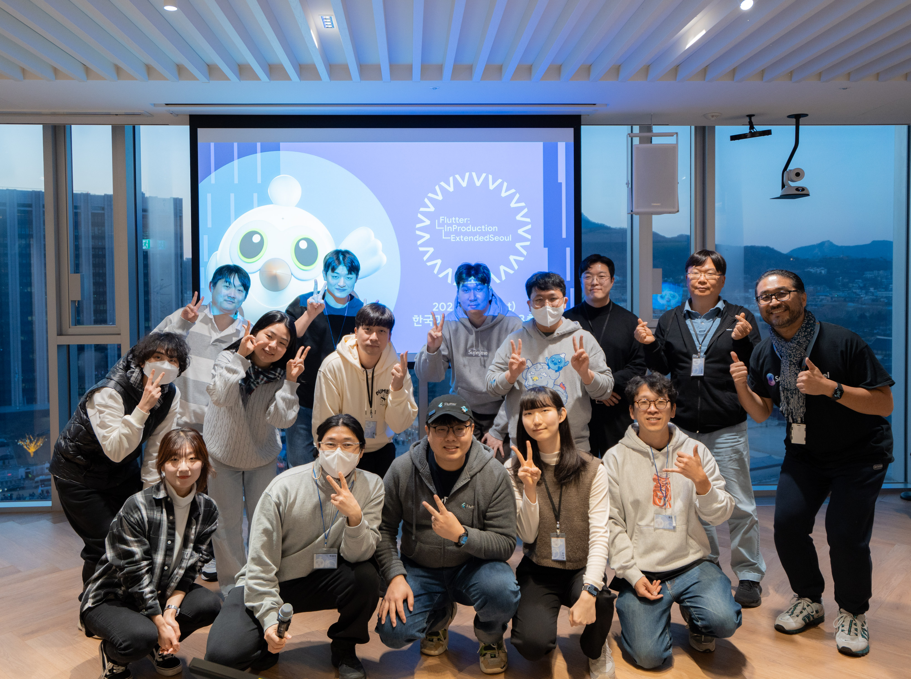

# Flutter Seoul Newsletter 14호

안녕하세요, 플러터 서울 커뮤니티의 홍종표(HDD), 박제창(Dreamwalker)입니다.

희망찬 계묘년 새해가 밝았습니다! 🐰

그리고 Flutter Seoul Newsletter가 6개월 만에 돌아왔습니다! 🎉 지난 6월 이후로 오랜만에 인사드리게 되어 정말 반갑습니다.

설날에는 맛있는 음식 많이 드시고, 가족들과 함께 따뜻하고 행복한 시간 보내시길 바랍니다. 새해에는 더욱 풍성하고 유익한 내용으로 찾아뵙겠습니다.

이번 호에서는 다음과 같은 내용을 다룹니다.

- **Flutter In Production 확장 행사 소식**
- **Flutter 패키지 소식**
- **Flutter 로 제작된 앱 소개**
- **Flutter 관련 게시글**

---

# **1. Flutter In Production 확장 행사 소식**

지난 1월 11일 Flutter In Production Extended Seoul 행사가 열렸습니다.

진행된 세션은 아래와 같습니다:

- Wrap up Flutter in Product & Flutter 3.27
    - 류지영님, 송승현님
- webOS TV에서 Flutter를 채택한 이유
    - 이동영님
- [Flutter를 위한 AI 백엔드 앱 만들어보기, 그런데 Semantic Kernel을 곁들인](https://1drv.ms/b/c/41b917f1613487b5/ETYTKpNp3dlPsxp-NEUQFOoBTWmuv1BBiGuegRYMVWmOLw?e=0xpSGg)
    - 유저스틴님
- 위의 백엔드를 Flutter에서 Riverpod + Dio + Retrofit으로 소통하기
    - 유병욱님
- [Pub workspaces로 monorepo 구성하기](https://speakerdeck.com/itsmedreamwalker/pub-workspacesro-monorepo-guseonghagi-at-2025-flutter-in-production-bagjecang)
    - 박제창님
- [Widget Preview 위젯 개발 효율 높이기](https://docs.google.com/presentation/d/12_CThrF4fExoJuh8vNCIu-PgvGi0i0lCRYhKCw1RRjg/edit?usp=sharing)
    - Aiden님
- [Flutter 개발에서 DevTools를 활용하는 이유](https://docs.google.com/presentation/d/1-jVXMkavzCOveL2y-NfNZ36xd9rtFvaT9iFmr9M1MPw/edit?usp=sharing)
    - 천정환님
- [그 서비스가 운영되는 법 fastlane build_app —that.service](https://docs.google.com/presentation/d/1b8RObBDYinI7ulp-mSLaQLaIZqk124f6/edit?usp=sharing&ouid=104901353287534490040&rtpof=true&sd=true)
    - 가애KAAE님
- Remote Config를 이용하여 효율적이고 탄력적인 배너 제공하기
    - 남상혁님

발표 자료는 공개를 허락하신 연사자분들에 한해 공개됩니다.

👉 [Flutter Seoul 이벤터스](https://event-us.kr/flutterseoul/event) 링크를 통해 채널을 구독하시면 행사가 열릴 때 소식을 받아보실 수 있습니다.

# **2. Flutter 패키지 소식**

## **2.1. go_router status 변경**

go_router 패키지의 README 파일에 roadmap 항목이 추가 되었습니다.

> This package has entered a maintenance phase.  The Flutter team's primary focus will be on
addressing bug fixes and ensuring stability.  While active feature development is not currently
planned, we welcome and encourage community contributions to expand the package's functionality.
> 
> 
> 이 패키지는 유지보수 단계에 들어갔습니다.  Flutter 팀의 주요 초점은 다음과 같습니다.
> 버그 수정 및 안정성 보장에 중점을 둘 것입니다.  현재 적극적인 기능 개발은
> 계획되어 있지는 않지만, 패키지의 기능을 확장하기 위한 커뮤니티의 기여를 환영하고 권장합니다.
> 

이후 X, 레딧 커뮤니티에서는 go_router 패키지가 죽었으니 이제 어떤 router 패키지를 사용해야하는지 묻거나, 또는 이제 꼭 필요한 기능은 다 구현이 되었으니 괜찮지 않겠냐는 반응들이 있었습니다.

이후 go_router 패키지에서도 아래와 같은 내용으로 README 파일을 업데이트 했습니다:

> This package is considered feature-complete. The Flutter team's primary focus will be on addressing bug fixes and ensuring stability. While active feature development is not currently planned, we still welcome and encourage community contributions to expand the package's functionality.
>
> 이 패키지는 기능이 완성된 것으로 간주됩니다. Flutter 팀은 버그 수정과 안정성 확보에 중점을 두고 있습니다. 현재 적극적인 기능 개발은 계획되어 있지 않지만, 패키지의 기능을 확장하기 위한 커뮤니티의 기여를 환영하고 권장합니다.
> 

## **2.2. bloc 9.0 버전 출시**

가장 많이 사용되는 상태관리 라이브러리들 중 하나인 bloc 패키지의 새로운 메이저 버전이 출시되었습니다.

예제와 튜토리얼들도 업데이트 되었고, 마이그레이션 가이드도 제공 중이라고 합니다.

또한 새로운 패키지들이 개발중이라고 하니 기대해도 좋을 것 같습니다.

👉 [bloc 마이그레이션 링크](https://bloclibrary.dev/migration/)

## **2.3. card_game 패키지 소개**

카드 게임을 쉽게 만들 수 있는 선언형 Flutter 패키지인 card_game 이라는 패키지가 출시되었습니다.

여러 카드 게임에서 애니메이션과 상호 작용 코드들이 많이 반복되는 것을 발견하여 재사용 가능한 패키지로 추상화했다고 합니다.

카드 이동, 뒤집기, 드래그 앤 드롭, 카드 스택, 이동 검증 등의 작업을 자동으로 처리하여 실제 게임을 만들 때 집중할 수 있다고 합니다.

👉 [pub.dev 링크](https://pub.dev/packages/card_game)

패키지 제작자분께서는 플러터 개발자들이 이 패키지를 활용하여 만든 게임 소식을 듣고 싶다고 합니다.

카드 게임을 좋아하신다면 한번 만들어보는건 어떨까요? 🃏

## 2.4. **infinite_calendar_view 패키지 소개**

Outlook, Teams 등에 영향을 받아 사용하기 쉬운 infinite_calendar_view를 소개드립니다.

아래와 같은 다양한 기능을 사용할 수 있다고 합니다:

- 며칠에 걸친 이벤트 관리
- 확대/축소
- 드래그 앤 드롭
- 다중 열
- 월별 보기

👉 [pub.dev 링크](https://pub.dev/packages/infinite_calendar_view)

# **3. Flutter 관련 앱, 오픈소스 소개**

## **3.1. Depths of Endor (엔도의 깊이: 던전 크롤러)**

게임 소개 사이트:

[Depths Of Endor: Retro Dungeon Crawler RPG](https://depthsofendor.com/)

게임을 플레이 해보니 옛날 웹 게임을 하는 듯한 느낌을 받을 수 있었습니다.

플러터로 이런 게임도 만들 수 있다는 영감을 받아 소개하게 되었습니다.

현재 앱은 안드로이드, iOS 그리고 Steam에 배포되어 있다고 합니다.

Flutter로 제작된 앱을 Steam에 배포할 땐 [steamwork](https://pub.dev/packages/steamworks) 라는 패키지를 사용하여 배포한다고 합니다.

## **3.2. Flutter Shark (Android Only)**

👉 [FlutterShark: Flutter App Info - Apps on Google Play](https://play.google.com/store/apps/details?id=com.fluttershark.fluttersharkapp)

장치에서 Flutter로 제작된 앱, 그리고 그 앱이 사용하는 모든 패키지를 찾을 수 있도록 도와주는 앱이라고 합니다.

이 앱을 사용하면 Flutter로 제작된 앱을 쉽게 찾을 수 있을 것 같네요.

참고로 Google에서 제작된 앱은 Stable 버전이 아닌 Flutter 3.28 버전을 사용 중이라고 합니다.

## **3.3. wetube_flutter (Android Only)**

👉 [Github Repository 링크](https://github.com/Purehi/wetube_flutter)

👉 [WeTube: Video, Music & Podcast - Apps on Google Play](https://play.google.com/store/apps/details?id=free.mor.mordo.do&q=youtube,video,music,podcast,drama&pli=1)

실제로 플레이스토어를 통해 앱을 설치해서 사용해보면 광고가 다소 많이 나와 불편하긴 하지만 오픈소스로 공개되어 있으니 실제로 사용해보고 소스 코드를 보는 것이 도움될 수 있어 공유드립니다.

# **4. Flutter 관련 게시글**

## 4.1 **Protecting Flutter Apps from Reverse Engineering and Tampering (Medium 회원 전용 스토리)**

👉 [Protecting Flutter Apps from Reverse Engineering and Tampering](https://medium.com/tech-vibes/protecting-flutter-apps-from-reverse-engineering-and-tampering-bb71330dbb7b)

`--obfuscate --split-debug-info` 명령어를 통해 Flutter의 Dart 코드를 난독화하는 방법 등 리버스 엔지니어링으로 부터 보호하는 법을 알려주는 게시글 입니다.

---

**Flutter Seoul 뉴스레터 구독하기**

Flutter Seoul 의 뉴스레터 구독을 원하시는 분들은 해당 리포지토리의 `watch` 눌러 구독하실 수 있습니다

---

플러터 서울 공식 트위터: [@FlutterSeoul](https://twitter.com/flutterseoul?s=21&t=1lvvhkp7LX_b-JT8sVoYCA)

플러터 서울 공식 디스코드: [https://flutter-seoul.com](https://flutter-seoul.com/)

플러터 서울 공식 오픈 카카오톡: [참여하기](https://open.kakao.com/o/gdL2Gj1e)

플러터 서울 공식 밋업: [https://meetup.flutter-seoul.com](https://meetup.flutter-seoul.com/)