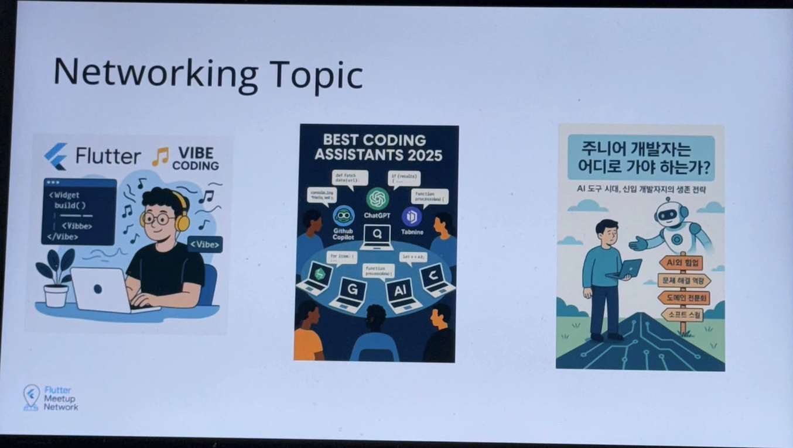
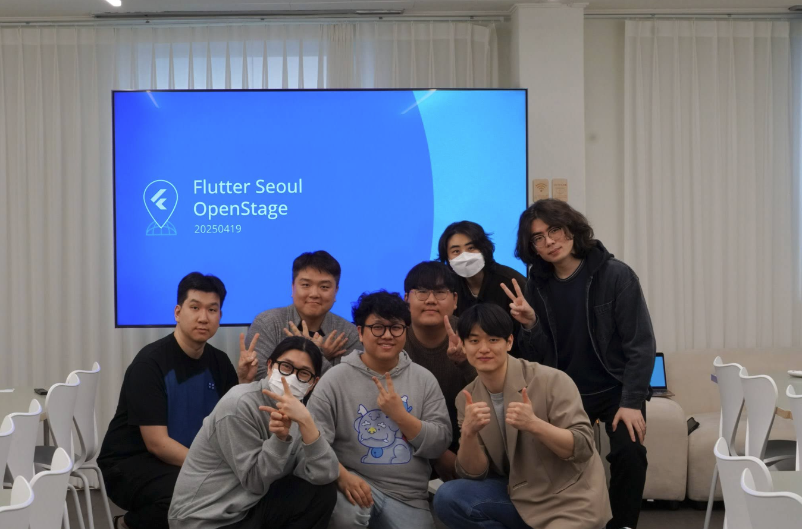

# Flutter Seoul Newsletter 17호

안녕하세요, 플러터 서울 홍종표(HDD), 박제창(Dreamwalker)입니다. 

봄의 시작을 알리는 4월이 찾아왔습니다. 따스한 햇살과 함께 새로운 에너지가 넘치는 이 계절에, 플러터 커뮤니티도 더욱 활기찬 모습으로 여러분을 맞이합니다. 이번 호에서는 플러터 개발자 여러분께 영감과 실질적인 도움을 드릴 수 있는 소식들을 준비했습니다. 함께 확인해 볼까요?

이번 호에서는 다음과 같은 내용을 다룹니다.

* **Flutter Seoul 이벤트 관련 소식**  
* **Google I/O 25 행사 소식**  
* **Flutter 3.29 패치 업데이트 소식**  
* **Flutter 패키지 소식**  
* **Flutter 관련 게시글**

---

## 1. 25년 4월 Flutter Seoul OpenStage 

안녕하세요. 2025년 4월 19일 (토) Flutter Seoul에서 준비한 4월 오픈스테이지 밋업이 성황리에 마무리되었습니다. 오픈스테이지는 Flutter 개발자뿐 아니라 다양한 기술과 경험을 가진 분들 모두에게 열린 밋업으로 지식을 나누고 싶었던 분, 다른 개발자들과 교류하고 싶은 분이라면 누구나 참석이 가능한 행사입니다. 이번 밋업에 참석해주신 분들께 다시 한번 감사 인사 드립니다.   
다음 플러터 서울의 밋업 그리고 오픈스테이지 행사도 많은 관심 부탁드립니다.

### 4월 오픈스테이지 세션 

* JY: API 디버깅 응급조치\!  
* 박준우: 파란만장 Flutter 현업 생존기(feat. Getx)  
* woong.2: Bloc 클린 아키텍처 구현기  
* 박종민: Flutter와 C++ 코드 간의 브리지 작성 경험  
* 장영하(마이): Flutter, Firebase로 macOS 프로그램 개발, 배포  
* 유동민: Trunk는 시작일 뿐: Flutter 개발 환경 자동화 실전기  
* 윤민혁: Flutter를 기반으로한 피지컬 디바이스 코딩 툴 \- 웹 앱

### 네트워킹 세션 

다함께 찰칵   

## 2. Google I/O 25 행사 소식

Google I/O는 Google이 매년 개최하는 개발자 컨퍼런스로, 최신 기술 동향, 새로운 제품 발표, 다양한 기술 세션 등을 통해 전 세계 개발자들에게 영감을 주고 정보를 공유하는 중요한 행사입니다. Flutter 개발자들에게도 Flutter와 Dart의 최신 업데이트, 새로운 기능, 향후 로드맵 등을 직접 확인하고 배울 수 있는 좋은 기회입니다.

이번 Google I/O 에서 예정된 Flutter 관련 세션은 세가지가 있습니다:

### 2.1 [What’s new in Flutter](https://io.google/2025/explore/pa-keynote-12)

이 세션에서는 Dart와 Flutter의 최신 릴리스에 대해 알아봅니다. 현대적인 앱 개발자들의 요구를 충족시키기 위해 Dart와 Flutter가 어떻게 발전하고 있는지 배우게 됩니다. 또한, Flutter 프레임 워크의 업데이트 내용과 다양한 플랫폼에서 고품질의 성능 좋은 앱을 구축하는 방법들에 대한 정보도 얻을 수 있습니다.

### 2.2 [Build agentic apps with flutter and Vertex AI in Firebase](https://io.google/2025/explore/technical-session-6)

이 세션에서는 멀티모달 AI가 사용자 애플리케이션 상호작용 방식을 어떻게 변화시키고 있는지 알아봅니다. Flutter, Firebase, 그리고 Gemini를 활용하여 안전하고 확장 가능하며 지능적인 멀티플랫폼 및 멀티모달 AI 앱을 구축하는 방법을 탐구합니다.

최첨단 앱의 아키텍처를 분석하여, 단일 코드베이스를 사용해 웹 및 모바일 환경에 음성, 이미지, 텍스트 상호작용을 원활하게 통합하는 방법을 시연합니다. 또한, Google Cloud가 지원하는 최신 AI 기술 발전을 기반으로 매력적인 사용자 경험을 만드는 방법도 공유할 예정입니다.

### 2.3 [How Flutter makes the most of your platforms](https://io.google/2025/explore/technical-session-25)

네이티브 API와 상호작용하고 플랫폼별 UI 컴포넌트를 사용하여, Android와 iOS에서 마치 네이티브 앱처럼 자연스러운 모습과 느낌을 제공하는 Flutter 앱을 구축하는 방법을 알아보세요.

## 3. Flutter 3.29 패치 업데이트 소식

최신 Flutter 안정화 버전인 **3.29.3 패치**가 릴리스되었습니다. 이번 업데이트는 여러 버그 수정과 안정성 개선에 초점을 맞춰 개발 경험을 향상시키는 데 중점을 두었습니다.

주요 변경 사항은 다음과 같습니다.

**✨ 주요 개선 및 수정 사항 ✨**

* Impeller 렌더링 엔진 개선:  
  * 안드로이드 에뮬레이터에서 배경 블러(backdrop blur) 효과가 포함된 화면으로 이동 시 발생하던 앱 충돌 문제를 해결했습니다. (flutter/163421)  
  * 텍스트를 48배 이상 크게 확대했을 때 잘못 렌더링되던 문제를 수정했습니다 (모든 플랫폼). (flutter/165166)  
* 개발 환경 및 도구:  
  * Git Hook 사용 시 flutter 명령어 실행 오류를 해결했습니다 (GIT\_DIR 환경 변수 관련). (flutter/165818)  
  * CI(지속적 통합) 환경 및 테스트에서 최신 Xcode 16 및 iOS 18 시뮬레이터를 사용하도록 업데이트했습니다. (flutter/165166)  
  * 디버거에서 '처리되지 않은 예외 시 일시 중지' 옵션이 활성화된 상태이고, compute 또는 Isolate.run 작업이 완료되지 않았을 때 Hot Restart가 멈추는 현상을 수정했습니다 (모든 플랫폼). (flutter/161466)  
* 지역화 (Localization):  
  * ARB 지역화 사용 시 플레이스홀더의 타입 추론이 제대로 되지 않아 발생할 수 있었던 타입 불일치 문제를 해결했습니다. (flutter/163627)

## 4. Flutter 패키지 소식

### 4.1 [asuka](https://pub.dev/packages/asuka)

asuka는 Flutter의 Snackbar, Dialog 및 ModalSheet와 같은 일부 시각적 요소를 구현할 때 간단하고 깔끔한 접근 방식을 목표로 하는 Dart 패키지입니다. 몇 줄의 직관적인 코드를 사용하여 처음부터 코딩하는 번거로움 없이 프로젝트에서 이러한 요소를 사용할 수 있으며, 필요할 경우 빠르게 제거할 수 있는 옵션도 제공합니다.

### 4.2 [flutter\_box\_transform](https://pub.dev/packages/flutter_box_transform)

Flutter Box Transform은 Flutter 위젯을 사용하여 박스 크기 조정 및 드래그를 프로그래밍 방식으로 처리할 수 있도록 하는 Flutter 패키지입니다. 모든 Flutter 프로젝트에서 사용할 수 있는 매우 유연하고 프로그래밍 방식으로 크기 조정 및 드래그가 가능한 박스를 제공합니다. 이 패키지는 내부적으로 Box Transform API를 사용합니다.

### 4.3 [dart\_mappable](https://pub.dev/packages/dart_mappable) 

dart_mappable 은 기본적인 기능(JSON 변환, == 연산자 재정의, hashCode, toString(), copyWith)을 모두 지원하며, 제네릭, 상속 및 다형성, 사용자 정의 등 고급 사용 사례에 대한 새롭거나 개선된 지원을 추가합니다.  
🎁 직렬화, 동등성 비교, 문자열 변환, 복사 등 모든 기능을 포함합니다  
🚀 제네릭, 다형성 및 다중 상속 등도 쉽게 처리합니다.   
🎛️ 직렬화를 사용자 정의하고, 사용자 정의 타입을 추가하거나 다른 패키지와 통합할 수 있어 매우 유연합니다.   
🔥 어떤 클래스를 사용하든 문제없이 작동하는 것을 약속합니다.   
(지원되지 않는 경우를 발견하시면 쿠키를 드립니다 🍪. 그리고 GitHub에 이슈를 등록해 주세요.)

## 5. Flutter 관련 게시글

### Agentic apps with Flutter | Observable Flutter \#59

[Agentic apps with Flutter | Observable Flutter \#59](https://www.youtube.com/watch?v=eczLRG3q4V0)  

### Agentic apps, part 2 | Observable Flutter

[Agentic apps, part 2 | Observable Flutter](https://www.youtube.com/watch?v=LwDFKGcIHXA)  

## 6. 그 밖의 소식

지난 2024년 5월 Google I/O에서, 기존에 Project IDX로 알려졌던 Google의 웹 기반 개발 환경이 Firebase Studio라는 새로운 이름으로 공식 리브랜딩되었습니다\!

Firebase Studio란 무엇인가요?

Firebase Studio는 Firebase를 사용하여 풀스택 웹 및 모바일 애플리케이션을 구축하는 개발자들을 위해 특별히 설계된 **웹 기반 통합 개발 환경(IDE**)입니다. 기존 Project IDX의 강력한 기능들을 기반으로, Firebase 생태계와의 연동성을 극대화하여 개발 경험을 한 차원 높이는 것을 목표로 합니다.

주요 특징 및 장점:

* Firebase와의 완벽 통합: IDE 내에서 Firebase 인증, Firestore, 실시간 데이터베이스, Cloud Functions, 호스팅 등 다양한 Firebase 서비스를 더욱 쉽고 직관적으로 설정, 관리, 배포할 수 있습니다. Firebase 프로젝트와의 연결이 그 어느 때보다 간편해집니다.  
* AI 기반 개발 지원 (Gemini): 코드 자동 완성, 설명, 생성, 버그 수정 제안 등 Gemini AI의 강력한 기능을 활용하여 개발 생산성을 크게 향상시킬 수 있습니다.  
* 클라우드 기반 환경: 별도의 로컬 개발 환경 설정 없이 웹 브라우저만 있으면 어디서든 바로 코딩을 시작하고 프로젝트에 접근할 수 있습니다. 팀원들과의 실시간 협업도 용이합니다.  
* 내장 미리보기 및 에뮬레이터: Android, iOS(웹 기반), 웹 애플리케이션을 위한 미리보기 및 에뮬레이터/시뮬레이터가 내장되어 있어, 개발 중인 앱의 모습을 실시간으로 확인하고 테스트할 수 있습니다.  
* 다양한 프레임워크 템플릿: Flutter, Next.js, React, Angular, Svelte, Vue 등 인기 있는 웹 및 모바일 프레임워크를 위한 사전 구성된 템플릿을 제공하여 빠르게 프로젝트를 시작할 수 있습니다.  
* 익숙한 개발 환경: VS Code의 핵심인 Code-OSS를 기반으로 하여 많은 개발자에게 익숙한 인터페이스와 확장성을 제공합니다.

Firebase를 사용한 앱 개발의 시작부터 배포, 관리까지 전 과정을 더욱 효율적으로 만들 것으로 기대됩니다.

지금 바로 경험해보세요\! [https://firebase.studio/](https://firebase.studio/)  
자세한 내용은 블로그 글을 참고해 보세요. [https://cloud.google.com/blog/products/application-development/firebase-studio-lets-you-build-full-stack-ai-apps-with-gemini](https://cloud.google.com/blog/products/application-development/firebase-studio-lets-you-build-full-stack-ai-apps-with-gemini)

# ---

이번 호에서는 Flutter Seoul 이벤트, Flutter 3.29 패치 업데이트, 새로운 패키지 소식, 그리고 유용한 게시글들을 소개해 드렸습니다. 여러분의 개발 여정에 작은 영감과 도움이 되었기를 바랍니다.

여러분의 열정과 참여 덕분에 플러터 커뮤니티가 더욱 빛나고 있습니다. 다음 호에서도 최신 소식과 유익한 정보를 가득 담아 찾아뵙겠습니다. 늘 함께해 주셔서 감사합니다\! 🚀

---

**Flutter Seoul 뉴스레터 구독하기**

Flutter Seoul 의 뉴스레터 구독을 원하시는 분들은 해당 리포지토리의 `watch` 눌러 구독하실 수 있습니다

---

플러터 서울 공식 트위터: [@FlutterSeoul](https://twitter.com/flutterseoul?s=21&t=1lvvhkp7LX_b-JT8sVoYCA)

플러터 서울 공식 디스코드: [https://flutter-seoul.com](https://flutter-seoul.com)

플러터 서울 공식 오픈 카카오톡: [참여하기](https://open.kakao.com/o/gdL2Gj1e)

플러터 서울 공식 밋업: [https://meetup.flutter-seoul.com](https://meetup.flutter-seoul.com)
