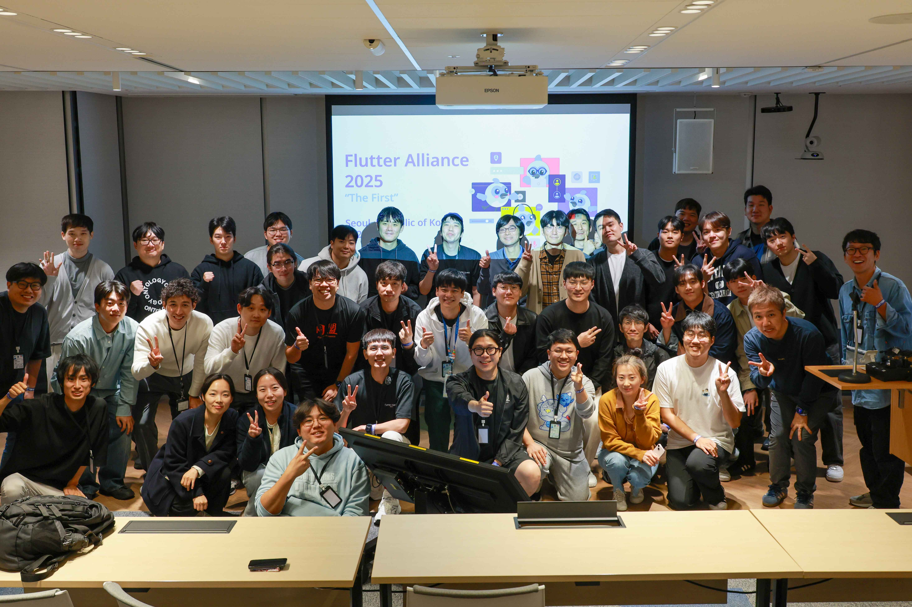
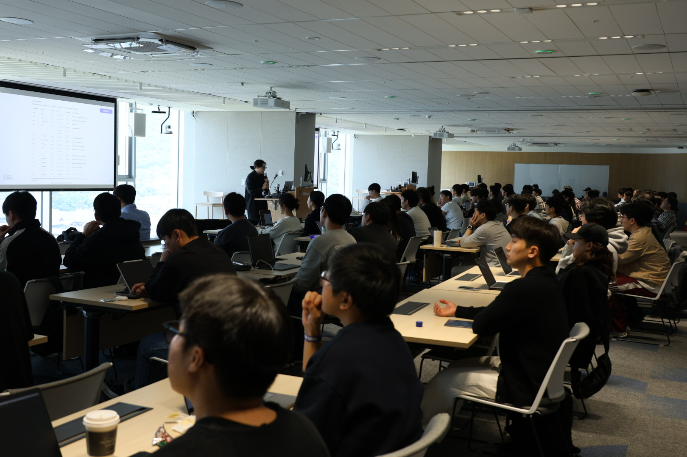
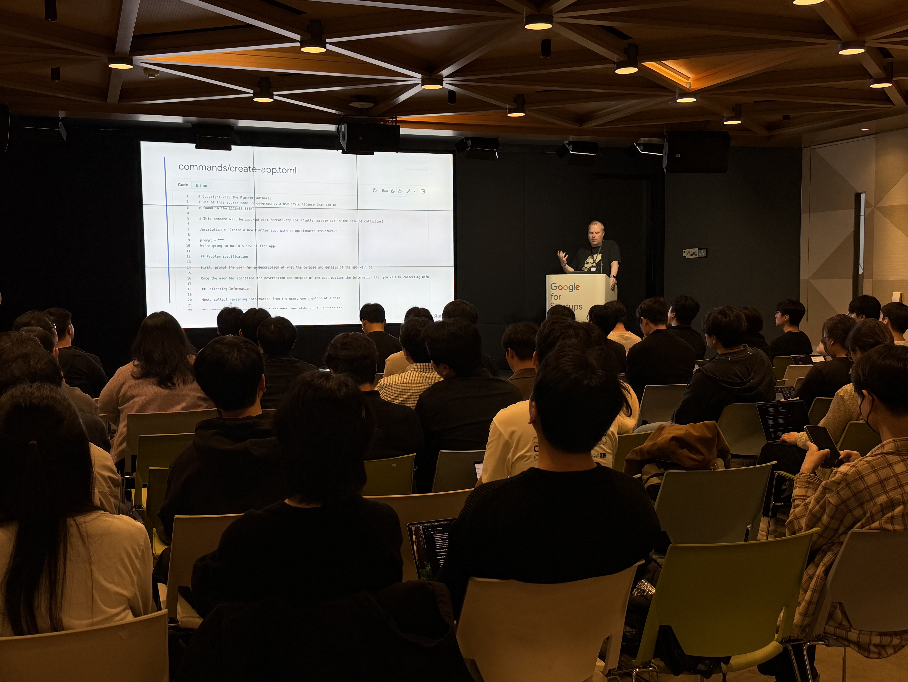

# Flutter Seoul Newsletter 23호

안녕하세요, 플러터 서울 홍종표(HDD), 박제창(Dreamwalker)입니다. 추석 연휴는 잘 보내셨나요?

갑자기 쌀쌀해진 날씨에 감기 조심하시고 따뜻한 코딩 환경과 함께 건강 유의하시길 바랍니다.

10월은 Flutter의 APAC 커뮤니티가 함께 개최하는 Flutter Alliance 행사와 Flutter Korea 2025 행사들로 저희에게도 특별한 시간이었습니다.

그럼 뉴스레터 10월호 시작합니다.

이번 호에서는 다음과 같은 내용을 다룹니다.

- Flutter 3.35 & Dart 3.9 패치 소식  
- Flutter Seoul 행사 소식
- 주목할 만한 Flutter 영상
- Flutter Package 소개  
- Flutter 오픈소스 소개

# Flutter 3.35 & Dart 3.9 패치 소식

이번 달도 두 번의 플러터 패치가 있었습니다. 최신 빌드 도구 지원부터 메모리 누수 완화까지, 개발 환경의 안정성을 높이는 개선사항들이 포함되어 있으니 확인해보세요.

**3.35.6**

* [flutter/175669](https://github.com/flutter/flutter/issues/175669): `flutter analyze --suggestions` 명령이 Java 25, Gradle 9, AGP 9, Kotlin 2.2.20 버전까지 지원합니다.  
* [flutter/172624](https://github.com/flutter/flutter/issues/172624): Impeller Vulkan 백엔드 사용 시 파이프라인 캐시가 손상될 수 있는 문제를 수정했습니다.

**3.35.7**

* [flutter/174082](https://github.com/flutter/flutter/issues/174082): 모든 플랫폼에서 MenuController 클래스를 확장하는 앱이 빌드 시 컴파일 타임 오류를 발생시키는 문제를 수정했습니다.  
* [flutter/173770](https://github.com/flutter/flutter/issues/173770): Android에서 Activity가 종료 시 유지되지 않고 Activity를 종료했다가 다시 진입할 때 발생하는 메모리 누수를 완화했습니다.

# Flutter Seoul 행사 소식

## Flutter Alliance 2025

올해 APAC 지역 Flutter 개발자를 위한 컨퍼런스가 서울에서 성황리에 개최되었습니다. Flutter Seoul, Tokyo, Taipei가 함께 준비한 이번 행사는 10개 이상의 세션과 2개의 핸즈온으로 구성되었으며, 해외 개발자들과 직접 교류하는 뜻깊은 시간이었습니다.  

* 일자: 2025년 10월 19일 (일) 10시 30분 \- 17시 00분  
* 장소: [한국마이크로소프트 13층](https://maps.app.goo.gl/99p5Nn4TfNWp8azF7) (서울특별시 종로구 중학동 종로1길 50\)  
* 주관**:** Flutter Seoul, Flutter Tokyo, Flutter Taipei

Flutter Alience 참여하셨던 Flutter Seoul의 nine님, 가애님의 후기들도 공유 드립니다.

- nine: 플러터 얼라이언스 The First : 발표 후기  
  - 링크: [https://medium.com/@arcanine33/%ED%94%8C%EB%9F%AC%ED%84%B0-%EC%96%BC%EB%9D%BC%EC%9D%B4%EC%96%B8%EC%8A%A4-the-first-%EB%B0%9C%ED%91%9C-%ED%9B%84%EA%B8%B0-7aecdb3180de](https://medium.com/@arcanine33/%ED%94%8C%EB%9F%AC%ED%84%B0-%EC%96%BC%EB%9D%BC%EC%9D%B4%EC%96%B8%EC%8A%A4-the-first-%EB%B0%9C%ED%91%9C-%ED%9B%84%EA%B8%B0-7aecdb3180de)  
- 가애KAAE: Flutter Alliance 2025 회고  
  - 링크: [https://brunch.co.kr/@jkaae93/57](https://brunch.co.kr/@jkaae93/57)

## Flutter Korea 2025

Flutter Korea 2025가 구글 스타트업 캠퍼스에서 성황리에 마무리되었습니다. Gemini CLI부터 접근성, 딥링크, gRPC까지 다양한 주제의 세션과 핸즈온이 진행되었으며, 국내외 개발자들이 실무 경험과 인사이트를 나누는 풍성한 하루였습니다.  

* 일자: 2025년 10월 25일 (토) 13시 00분 \- 21시 00분  
* 장소: 구글 스타트업 캠퍼스 서울  
* 주관: Flutter Seoul

### 발표 자료

다양하고 실제 겪을 법한 주제들로 굉장히 알찬 발표들이 있었습니다.

- 권태형/고려대학교: thorvg.flutter를 소개합니다\! : lottie에서 thorvg로, 사용자에서 기여자로  
  - 발표 자료: [https://speakerdeck.com/taebbong/thorvg-dot-flutter](https://speakerdeck.com/taebbong/thorvg-dot-flutter)  
- 이상훈/발트루스트: Focus & TTS로 구현한 3계층 접근성 패턴, 시각 장애인도 사용 가능한 앱 만들기 : Barrier-Free Kiosk  
  - 발표 자료: [https://github.com/FlutterNeverDie/flutter\_korea\_2025\_barrier\_free\_speaker\_sanghoon\_lee](https://github.com/FlutterNeverDie/flutter_korea_2025_barrier_free_speaker_sanghoon_lee)  
- 최수범/AB180 Technical Product Manager  
  - 발표자료: [https://github.com/ab180/deeplink-session-flutter-korea-2025](https://github.com/ab180/deeplink-session-flutter-korea-2025)  
- 송민우/다날: REST에 익숙한 내가 gRPC에서는 신입인 세상에서  
  - 발표자료: [https://github.com/MoerAI/flutter\_korea\_2025](https://github.com/MoerAI/flutter_korea_2025)  
- 가애KAAE/Flutter Seoul: 안녕하세요. 고객님, 서비스 종료를 안내드립니다.  
  - 발표자료: [https://docs.google.com/presentation/d/1JS-QzeJBoZCZErpUSmWlw0IGoQI32p\_VyjbsSuegEpU](https://docs.google.com/presentation/d/1JS-QzeJBoZCZErpUSmWlw0IGoQI32p_VyjbsSuegEpU)

### 바이브 코딩 해커톤 수상작

2시간이라는 짧은 시간안에 AI 를 활용한 바이브 코딩으로 고퀄리티 앱들을 만들어주셨습니다.  
그냥 넘어가기 아쉬운 고 퀄리티 앱들 공유 드립니다.

- 1등: Malmot 💖 \- 스마트 커플 채팅 분석 앱  
  - Github 링크: [https://github.com/tfoseel/malmot](https://github.com/tfoseel/malmot)   
- 2등: MetaNote 🧠✨- 문장이 아니라 생각의 연결을 그리는 노트  
  - Github 링크: [https://github.com/12Ray/flutter-korea-2025-hackathon](https://github.com/12Ray/flutter-korea-2025-hackathon)  
- 3등: 🏃 Run-Fit \- 초보 러너를 위한 간편한 러닝 앱  
  - Github 링크:[https://github.com/gdaegeun539/runfit\_flutter\_vibeton](https://github.com/gdaegeun539/runfit_flutter_vibeton) 

다시 한번 발표해주신 연사자분들과 바이브 코딩을 통해 멋진 작품들을 제출해주신 해커톤에 참여자 여러분들께 감사 인사 드립니다.

# 주목할 만한 Flutter 영상

### Flutter Thread Merge: Simplified Native Interop

Flutter가 UI 스레드와 플랫폼 스레드를 분리 운영하던 기존 아키텍처에서 벗어나, 모든 Dart 코드를 메인 플랫폼 스레드로 통합하는 대대적인 변화를 진행하고 있습니다. 이를 통해 플랫폼 API 호출 시 직렬화와 비동기 처리 없이 동기 호출이 가능해져 상호 운용성이 크게 개선됩니다. 자세한 내용은 영상을 참고해주세요.

Youtube 영상: [https://youtu.be/miW7vCmQwnw?si=MAJH3EEdxRFYwY0j](https://youtu.be/miW7vCmQwnw?si=MAJH3EEdxRFYwY0j)

# Flutter Package 소개

### ascii\_art\_converter 

이미지를 ASCII 아트로 변환해주는 Dart 패키지입니다. 라이브러리로 앱에 통합하거나 CLI 도구로 터미널에서 바로 사용할 수 있습니다. 출력 너비, 문자셋, 명도 반전 등을 커스터마이징할 수 있으며, 흑백부터 ANSI 256 컬러, 트루 컬러까지 다양한 컬러 모드를 지원합니다. 빠르고 가벼운 구현으로 이미지를 터미널에 출력하거나 레트로한 분위기의 아트를 생성하는데 활용할 수 있습니다.

pub.dev 링크: [https://pub.dev/packages/ascii\_art\_converter](https://pub.dev/packages/ascii_art_converter)

# Flutter 오픈소스 소개

### OSMEA \- Open Source Flutter Architecture for E-commerce

MasterFabric의 OSMEA는 엔터프라이즈급 이커머스 모바일 앱을 위한 Flutter 아키텍처 프레임워크입니다. Shopify, WooCommerce, BigCommerce 등 주요 이커머스 플랫폼과 연동 가능하며, Clean Architecture와 BLoC 패턴을 기반으로 설계되었습니다. 인증, 결제, 고객 관리, 주문 처리 등 12개의 핵심 모듈이 완성되어 있고, Material Design 3 기반의 UI 컴포넌트를 제공합니다. 모듈식 구조로 필요한 기능만 선택해서 사용할 수 있으며, 현재 40% 완성 상태로 활발히 개발 중입니다.

깃허브 링크: [https://github.com/masterfabric-mobile/osmea](https://github.com/masterfabric-mobile/osmea)

### retune \- Free and open source music player.

Flutter로 제작된 무료 오픈소스 음악 스트리밍 앱입니다. Saavn API를 활용해 다양한 노래를 재생할 수 있으며, 백그라운드 재생, 노래 검색, 아티스트 탐색 기능을 제공합니다. Hive를 사용한 지속적인 재생 대기열 관리와 스마트한 곡 추천 기능이 특징이며, 앰비언트한 분위기의 새로운 UI 디자인으로 사용자 경험을 개선했습니다. 음악 앱 개발에 관심 있는 분들에게 좋은 참고 자료가 될 것 같습니다.

깃허브 링크: [https://github.com/samvabya/retune](https://github.com/samvabya/retune)

---

**Flutter Seoul 뉴스레터 구독하기**

Flutter Seoul 의 뉴스레터 구독을 원하시는 분들은 해당 리포지토리의 `watch` 눌러 구독하실 수 있습니다

---

플러터 서울 공식 트위터: [@FlutterSeoul](https://twitter.com/flutterseoul?s=21&t=1lvvhkp7LX_b-JT8sVoYCA)

플러터 서울 공식 디스코드: [https://flutter-seoul.com](https://flutter-seoul.com)

플러터 서울 공식 오픈 카카오톡: [참여하기](https://open.kakao.com/o/gdL2Gj1e)

플러터 서울 공식 밋업: [https://meetup.flutter-seoul.com](https://meetup.flutter-seoul.com)