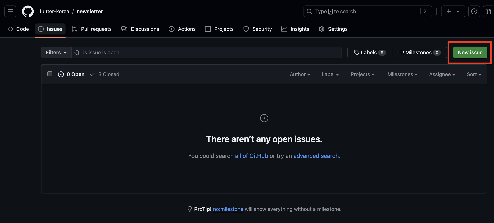
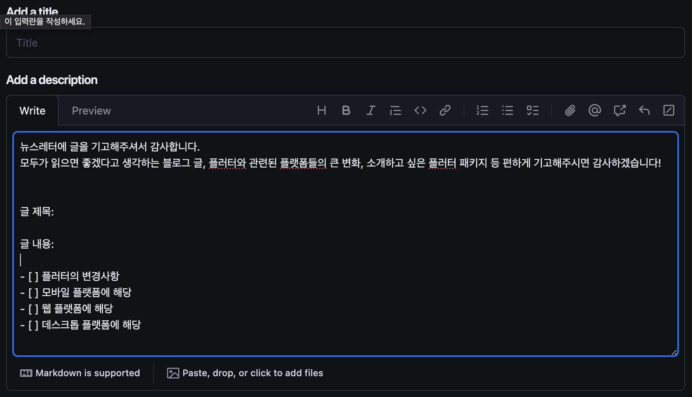
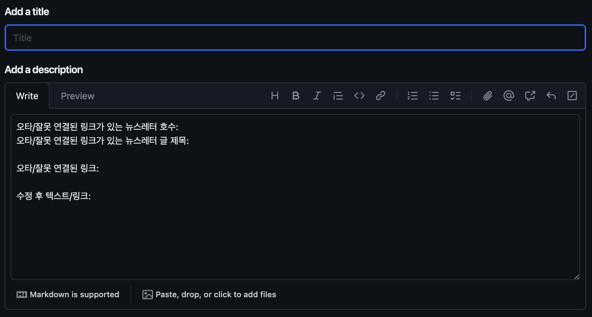
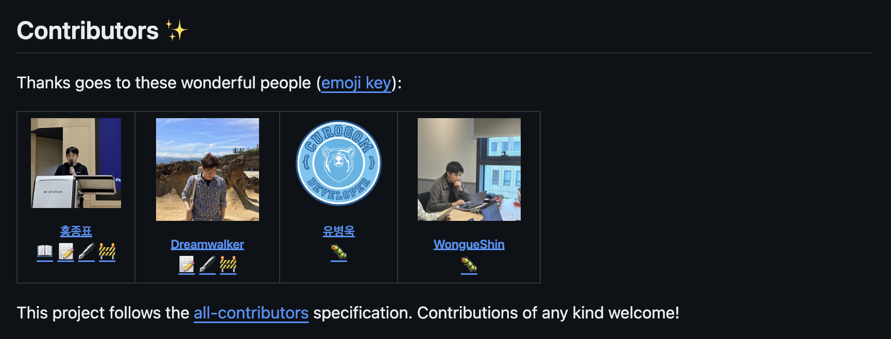

# Flutter Seoul Newsletter 11호

Flutter Seoul Newsletter 11호를 확인해주셔서 감사합니다.

플러터 서울 커뮤니티의 홍종표(HDD)와 박제창(Dreamwalker)입니다.

지난 뉴스레터에서는 봄의 시작을 알렸는데, 벌써 3월의 끝자락입니다.

봄의 시작이었던 3월 즐겁게 보내셨나요?

4월은 보다 더 따뜻한 날씨가 찾아올테니 더 행복하고 즐거운 일이 많이 생기기를 응원하겠습니다.

이번 호에서는 다음과 같은 내용을 다룹니다.

- Flutter SDK 패치 업데이트 소식
- Flutter Seoul Newsletter Repository 업데이트 소식
    - Github Issue 템플릿 추가
    - All-Contributors Bot 도입
- Shorebird 1.0 버전 출시 예정
- Apple Developer 뉴스 및 업데이트
    - AppStore Connect 업로드 관련 요구사항
    - App Store 앱 제출을 위한 개인정보 보호 관련 업데이트
- 2024 Google I/O

---

# 1. Flutter SDK 3.19.5 패치 업데이트

지난 10호 뉴스레터에서 가장 최신 버전은 3.19.2 버전이었습니다.

가장 최근 3월 28일에 나온 3.19.5 버전입니다.

패치 업데이트에 대한 내용은 Flutter 레포의 Hotfixes to the Stable Channel을 참고하시면 됩니다.

👉 [**Hotfixes to the Stable Channel**](https://github.com/flutter/flutter/wiki/Hotfixes-to-the-Stable-Channel)

# 2. Flutter Seoul Newsletter Repository 개편

## 2.1. 이슈 템플릿을 통한 뉴스레터 기고, 오타/잘못된 링크 수정 프로세스 추가

뉴스레터에 더 많은 플러터 개발자분들이 활발하게 참여할 수 있도록 간단한 이슈 템플릿을 만들게 되었습니다.

1. 이슈 생성

1. 이슈 카테고리 선택

1. 기고 / 이슈 수정 템플릿에 맞춰 작성
    
    
    
    
    

오타/잘못된 링크 수정 혹은 플러터와 관련된 좋은 소식들을 공유하시려면 편하게 이슈 생성을 통해 편하게 말씀부탁드립니다! 

## 2.2 All-Contributors bot 도입

뉴스레터에 더 많은 플러터 개발자분들이 활발하게 참여하며, 참여했을 때 보람을 느낄 수 있도록 All-contributors 봇을 도입했습니다.

👉 [all-contributors bot 이란?](https://allcontributors.org/)

앞으로 기고자의 경우 📝, 오타/잘못된 링크 수정의 경우 🐛 이모지로 뉴스레터 레포지터리에 감사한 분들을 계속 기록해나가려고합니다! 

더 좋은 뉴스레터를 만들어나가기 위해서 많은 참여 부탁드립니다.

# 3. ShoreBird 1.0 출시 예정

2일 전에 Shorebird 0.28.0 버전이 출시되었습니다.

해당 릴리즈를 통해 iOS 패치 성능이 크게 향상되었다고 합니다. 그리고 곧 1.0 버전 출시된다는 Eric Seidel님의 트윗도 있었는데요, 출시하기 전 해결해야하는 작은 이슈가 한가지 더 있다고 합니다.

Code Push 기능을 사용하게 해주는 ShoreBird의 정식 버전이 출시된다니 엄청 기대되는 것 같습니다.

👉 [ShoreBird 0.28.0 Release](https://twitter.com/shorebirddev/status/1773473093505147016?s=61&t=Y0C59QlgAk824_oQ14rXTg)

👉 [Eric Seidel님의 1.0 버전 관련 트윗](https://twitter.com/_eseidel/status/1773481002150858807?s=61&t=Y0C59QlgAk824_oQ14rXTg)

# 4. Apple Developer 뉴스 및 업데이트

## 4.1. AppStore Connect 업로드 관련 요구사항

> 2024년 4월 29일부터 App Store Connect에 업로드하는 앱은 [Xcode 15](https://apps.apple.com/kr/app/xcode/id497799835?mt=12)를 사용하여 [iOS 17](https://developer.apple.com/kr/ios/), [iPadOS 17](https://developer.apple.com/kr/ipados/), [tvOS 17](https://developer.apple.com/kr/tvos/), [watchOS 10](https://developer.apple.com/kr/watchos/)을 대상으로 빌드해야 합니다.
> 

혹시라도 이전 버전의 Xcode로 빌드 중이시라면, 업데이트를 준비하셔야할 것 같습니다.

👉 [4월 29일부터 적용되는 App Store Connect 업로드 관련 요구 사항](https://developer.apple.com/kr/news/?id=fxu2qp7b)

## 4.2. **App Store 앱 제출을 위한 개인정보 보호 관련 업데이트**

> 개발자는 자신의 앱에 포함된 모든 코드에 대한 책임이 있습니다. Apple은 WWDC23에서 널리 사용되는 타사 SDK를 위한 새로운 [개인정보 보호 매니페스트 및 서명](https://developer.apple.com/kr/support/third-party-SDK-requirements/) 기능을 발표했으며, 개발자가 앱의 개인정보 보호 매니페스트에서 [일부 API 세트를 사용하는 데 대한 허용된 사유(영문)](https://developer.apple.com/documentation/bundleresources/privacy_manifest_files/describing_use_of_required_reason_api)를 선언해야 함을 공지한 바 있습니다. 이러한 변경 사항은 개발자가 타사 SDK의 데이터 사용 방식, 소프트웨어 종속성 보안, 사용자 개인정보를 위해 제공되는 추가 보호 기능 등을 파악하는 데 도움이 됩니다.

> **3월 13일부터:** App Store Connect에 사유가 필요한 API를 사용하는 신규 앱 또는 업데이트된 앱을 업로드하는 경우, 앱의 개인정보 보호 매니페스트에 사유가 누락되면 이메일을 보내드립니다. 이 이메일은 App Store Connect의 기존 알림에 추가됩니다.

> **5월 1일부터:** 신규 앱 또는 업데이트된 앱의 코드에 특정 API를 사용할 경우, 이를 App Store Connect에 업로드하려면 허용된 사유를 포함해야 합니다. API를 허용된 사유에 따라 사용하지 않는 경우 다른 대안을 찾아보시기 바랍니다. 또한 흔히 사용되는 타사 SDK 목록에 새로운 타사 SDK를 추가하는 경우 이러한 API, 개인정보 보호 매니페스트, 서명 요건이 해당 SDK에 적용됩니다. 개인정보 보호 매니페스트가 포함된 버전의 SDK를 사용해야 합니다. 또한 SDK가 바이너리 종속성으로 추가된 경우 서명도 필요합니다.

Flutter, Firebase 및 많은 유저들이 사용하는 패키지 관리자분들께서 Privacy Manifest 관련하여 열심히 대응해주고 계신 것 같습니다. 4월 한달동안 배포에 문제가 없도록 Flutter의 Issue, 패키지 소식들을 열심히 확인해봐야할 것 같습니다. 

👉 [App Store 앱 제출을 위한 개인정보 보호 관련 업데이트](https://developer.apple.com/kr/news/?id=3d8a9yyh)

👉 [☂️ Support Privacy Manifest and Required APIs in iOS](https://github.com/flutter/flutter/issues/143232)

# 5. 2024 Google I/O 소식

5월 14일에 Google I/O가 개최될 예정이라고 합니다.

매년 Google I/O에서 Flutter 관련 새로운 버전과 소식들이 소개되었던 것 같습니다.

올해는 또 어떤 소식들을 전달해줄지 기대되네요!

👉 [2024 Google I/O 사이트](https://io.google/2024/intl/ko/?utm_source=devsite-hpp&utm_medium=embedded_marketing&utm_campaign=dgc-io-24&authuser=1&hl=ko)

---

**Flutter Seoul 뉴스레터 구독하기**

Flutter Seoul 의 뉴스레터 구독을 원하시는 분들은 해당 리포지토리의 `watch` 눌러 구독하실 수 있습니다

---

플러터 서울 공식 트위터: [@FlutterSeoul](https://twitter.com/flutterseoul?s=21&t=1lvvhkp7LX_b-JT8sVoYCA)

플러터 서울 공식 디스코드: [https://flutter-seoul.com](https://flutter-seoul.com)

플러터 서울 공식 오픈 카카오톡: [참여하기](https://open.kakao.com/o/gdL2Gj1e)

플러터 서울 공식 밋업: [https://meetup.flutter-seoul.com](https://meetup.flutter-seoul.com)