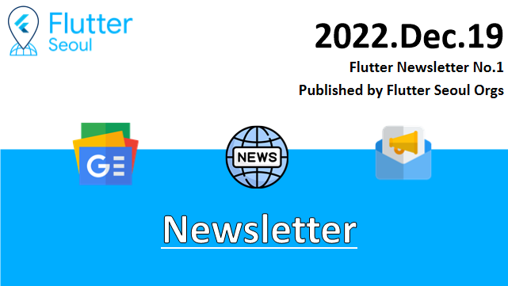
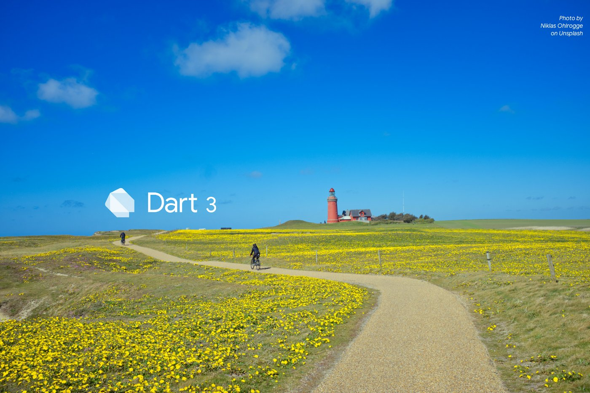
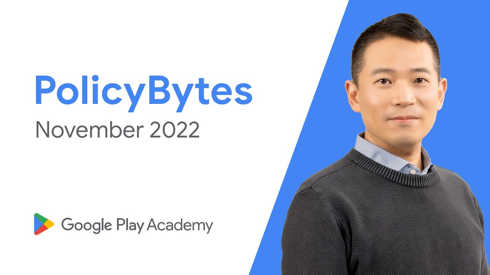
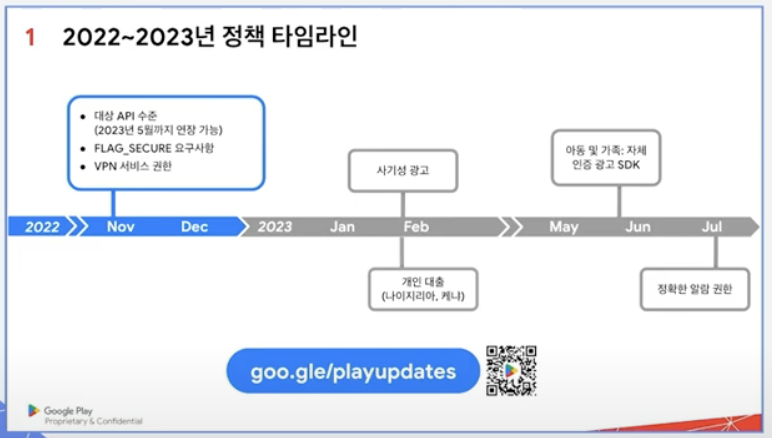
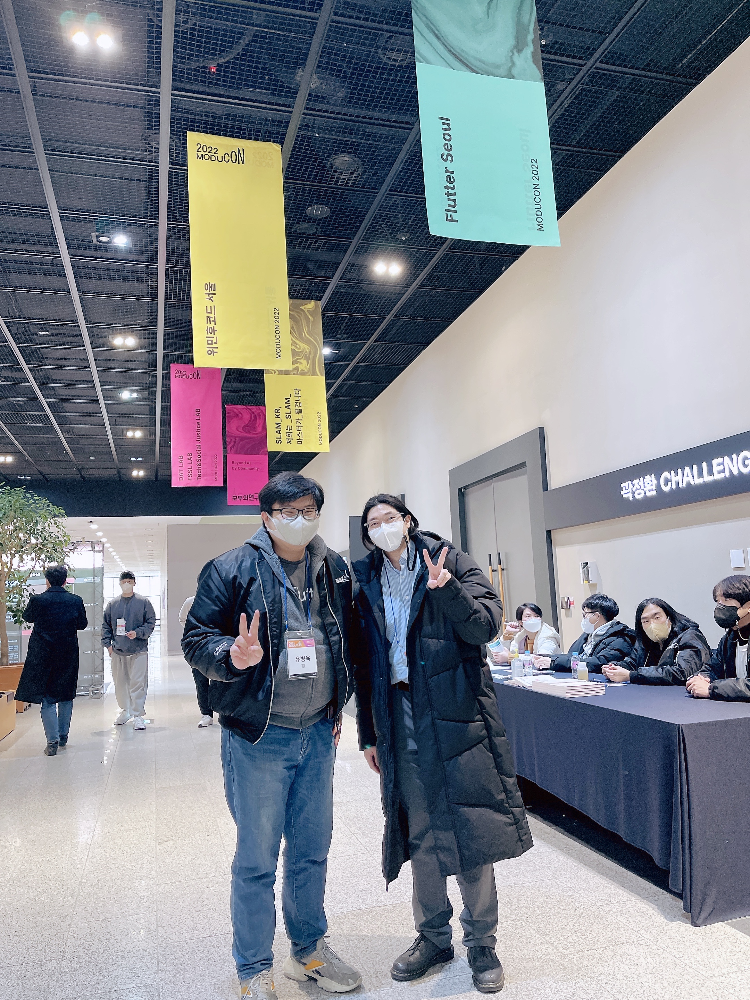

# 뉴스레터 1호

---

# Flutter Seoul Newsletter 발간



안녕하세요? 플러터 서울 커뮤니티의 홍종표(HDD)입니다.

달력을 보니 벌써 12월도 중순이네요. 다들 2022년 마무리 잘 하고 계신가요?

눈이 내려 미끄러운 빙판길, 추운 날씨에 건강 조심하시고 남은 22년 마무리 잘하셨으면 좋겠습니다!

이번 뉴스레터를 시작으로 플러터 서울 커뮤니티에서는 **플러터와 관련된, 플러터 개발자를 위한 플러터 소식**들을 수집해서 2주 ~ 4주의 텀을 가지며 정기적으로 뉴스레터를 발행할 계획입니다.

많은 관심 가져주시면 감사하겠습니다. 🙇‍♂️

---

# Flutter News

## 1.Flutter Forward 행사가 열립니다

editor 홍종표

> **Flutter Forward**
> 일시 : 2023년 1월 25일
> 장소 : Nairobi, Kenya . 온라인
>

[플러터 공식 트위터 링크](https://twitter.com/FlutterDev/status/1592593528390963200?s=20&t=_VOWef6iB5zDo3x4hRPvHw)

**2023년 1월 25일** **Flutter Forward** 행사에 하시면, 새로운 플러터 업데이트 소식들을 알려준다고 합니다. 어떤 변화들이 있을지 궁금하다면!! 해당 트윗의 링크를 통해 참여등록하실 수 있습니다!

---

## 2.Dart 3.0 무엇이 변할까요?

editor 홍종표, 송승현



Niklas Ohlroge , Unplash

> *해당 업데이트는 Flutter Forward 행사 혹은 차후에 발표될 내용들입니다*
>

Dart는 2.12 버전에서 null-safety를 지원하기 시작했습니다. 매우 큰 변화였지만 Dart 3.0이 아닌 Dart 2.x버전을 표방하였는데요. 이번에 Dart 3.0 버전이 예고되었습니다. 과연 어떤
변화가 일어날까요?

### 2.1 예고된 변경사항들

****[The road to Dart 3: A fully sound, null safe language](https://medium.com/dartlang/the-road-to-dart-3-afdd580fbefa)****
에 소개된 주요 변경사항은 다음과 같습니다.

- 다트 3에서 모든 다트 코드는 **Fully null safety**를 사용
- 핵심 라이브러리 변경, :를 통한 default paramter value 구문 제거, 암시적 call method 제거
- **패턴**이라고 불리는 언어의 기능을 추가. 내용들은 아래와 같습니다.
    - [Multiple return values](https://github.com/dart-lang/language/issues/68)
    - [Algebraic datatypes](https://github.com/dart-lang/language/issues/349)
    - [Patterns and related features](https://github.com/dart-lang/language/issues/546)
    - [Destructuring](https://github.com/dart-lang/language/issues/207)
    - [Sum types and pattern matching](https://github.com/dart-lang/language/issues/83)
    - [Extensible pattern matching](https://github.com/dart-lang/language/issues/1047)
    - [JDK 12-like switch statement](https://github.com/dart-lang/language/issues/27)
    - [Switch expression](https://github.com/dart-lang/language/issues/307)
    - [Type decomposition](https://github.com/dart-lang/language/issues/169)

다트 언어는 다른 언어들의 좋은점을 굉장히 잘 흡수하는 것 같습니다. 마이그레이션하는데 시간이 소요될 수 있지만 더 좋은 방향으로의 변화인 만큼 빨리 업데이트 소식을 받아볼 수 있으면 좋겠습니다. 더 자세한 내용은
아래의 링크를 통해 보실 수 있습니다.

[The road to Dart 3: A fully sound, null safe language](https://medium.com/dartlang/the-road-to-dart-3-afdd580fbefa)

---

## 3. AWS Amplify Flutter Web, Desktop 지원 시작(개발자 평가판)

editor 송승현

](../assets/newsletter_1st/3.png)

Abdallah Shaban, Muhammed Salih Güler, and Ashish Nanda
in [Front-End Web & Mobile](https://aws.amazon.com/blogs/mobile/category/mobile-services/)

Amplify는 AWS의 통합 개발환경 서비스로 AWS Cognito와 같은 인증 서비스 부터 AWS db 인스턴스 API Gateway 등 다양한 AWS 서비스를 손쉽게 통합가능한 AWS의 서비스입니다. 첫
출시부터 Flutter를 지원하면서 Flutter 개발자들에게도 큰 관심을 끌었습니다. 다만 Web과 Desktop은 Amplify 패키지를 지원하지 않아서 많은 개발자들이 아쉬워 했습니다. 이번 Amplify
개발자 프리뷰에서 **Flutter Web, Desktop 프로젝트 또한 Amplify 인증 서비스를 사용할 수 있게 되었습니다!**  AWS는 이번 인증 서비스를 시작으로 자동 빌드, 자동 배포 등의 다른
Amplify 서비스도 확대해 나가겠다고 합니다. 아래의 링크에서 자세한 소식과 Amplify 인증 실습 내용 & 한국어 리뷰(12월 21일 기고 예정)를 보실 수 있습니다.

**AWS 기사**

[AWS Amplify Flutter, 인증 시 웹 및 데스크톱 지원 발표(개발자 평가판)](https://aws.amazon.com/ko/about-aws/whats-new/2022/08/aws-amplify-flutter-announces-web-desktop-support-preview-authentication/)

****Authentication with AWS Amplify Flutter for Mobile, Web, and Desktop****

[Authentication with AWS Amplify Flutter for Mobile, Web, and Desktop | Amazon Web Services](https://aws.amazon.com/ko/blogs/mobile/amplify-flutter-auth-web-and-desktop/)

****Authentication with AWS Amplify Flutter for Mobile, Web, and Desktop(한국어 리뷰)****

---

## 4. 최근에 겪은 플러터/플러터 패키지 이슈들

editor 홍종표


Flutter Seoul에서는 자주일어나는 이슈를 수집하고 공유하여 Flutter 개발자들이 버그로 인한 어려움을 조금이나마 줄어보고자 합니다.

### 4-1 Flutter - Scrollable.ensureVisible을 이용하여 pinned 속성이 true인 SliverPersistentHeader를 찾을 때 과하게 스크롤이 되는 이슈

[https://github.com/flutter/flutter/issues/115964](https://github.com/flutter/flutter/issues/115964)

### 4-2 GoRouter - 같은 페이지로 다시 갈 수 없는 현상 (현재는 해결)

[https://github.com/flutter/flutter/issues/115832](https://github.com/flutter/flutter/issues/115832)

### 4-3 flutter_naver_login 1.7.0 이후로 로그인이 안되는 현상

(마이너 버전의 Breaking Change)

패키지의 공식문서의 README.md와 CHANGELOG.md 파일에도 작성된 마이너 버전에서 발생한 Breaking Change로 당황한 경험이 있어 공유합니다.

네이버 로그인 SDK가 5.2.0으로 올라가며 Flutter Activity → Flutter Fragment Activity 로 변경이 필요해졌다고 합니다.

[flutter_naver_login | Flutter Package](https://pub.dev/packages/flutter_naver_login)

```kotlin
import io.flutter.embedding.android.FlutterFragmentActivity

class MainActivity:FlutterFragmentActivity()
```

> 이 주제는 많은 분들의 도움이 필요합니다! 🙇‍♂️
> 
> 다들 플러터 / 플러터의 패키지들을 사용하시면서 겪으신 이슈들이 있다면 맨 아래의 구글폼을 통해 제보 부탁드립니다.
>

---

## 5. 구글 플레이 11월 정책 세미나

editor 홍종표



출처: ****Google Play 정책 바이트 - 2022년 11월 정책 업데이트 (Korean) 썸네일 이미지****

2022년 12월 1일 목요일 오후 2시에 구글 플레이 정책 세미나가 열렸습니다.

### 정책타임라인



출처: ****Google Play 11월 정책 업데이트와 준수사항 안내 4분 13초****

1. 아동 및 가족: 자체 인증 SDK 광고
2. 사기성 광고
3. 사용자 데이터 정책 설명
4. 더 나은 광고 경험(Better Ads Experiences)
   예상치 못한 전면 광고를 금지하는 새로운 가이드라인을 광고 정책에 추가

   [The Initial Better Ads Standards - Coalition for Better Ads](https://www.betterads.org/standards/#mobileapp)

5. 로그인 사용자 인증 정보
   1. 앱에서 로그인 화면이 있는 컨텐츠를 제공하지만 사용자 인증정보를 제공하지 않아 정책 위반으로 판단되는 경우가 많음.

[검토를 위한 앱 준비](https://support.google.com/googleplay/android-developer/answer/9859455?hl=ko)

### 권장사항

- 앱 리뷰 계획하기 - 사전에 계획하고 7일의 리드타임을 권장
- 관리형 게시 사용하기 - 앱이 검토 중인 시점, 승인된 시점, 게시 될 수 있는 시점을 알 수 있어 검토하거나 변경사항을 적용할 시간 확보 가능

위의 내용 뿐만 아니라 더 많은 내용을 세미나에서 친절하게 알려주고 있으니, 꼭 세미나를 보시고 정책 혹은 배포 과정에서 문제를 겪지 않으셨으면 좋겠습니다!

아래의 링크를 통해 다시보실 수 있습니다.

[Google Play 정책 세미나 2022](https://developersonair.withgoogle.com/events/policywebinar2022kr)

---

## 6. MODUCON2022 참가

editor 박제창, 유병욱

2022년 12월 15일 목요일 모두의 연구소에서 주최하는 MODUCON2022 행사에 Flutter Seoul의 박제창, 유병욱님이 연사로 참가했습니다.

> MODUCON 2022
> 행사일시 : 2022년 12월 15일
> 주최 : 모두의 연구소
> 참가자 : Flutter Seoul Orgs - 유병욱 ,박제창
>

[모두콘(MODUCON) - MODUCON2022](https://moducon.kr/)

### 6-1 참여세션정보

- ****Flutter와 함께하는 ML 세상 탐험하기 - 박제창****
    -
    발표자료: [https://speakerdeck.com/itsmedreamwalker/flutterwa-hamggehaneun-ml-sesang-tamheomhagi-at-moducon2022](https://speakerdeck.com/itsmedreamwalker/flutterwa-hamggehaneun-ml-sesang-tamheomhagi-at-moducon2022)

- ****Flutter, 어떻게 해야 더 잘 쓸까? (with, 3 years) - 유병욱****
  - 

### 6-2 Flutter Seoul Orgs in Moducon




---

## Flutter Seoul 뉴스레터 구독하기

Flutter Seoul 의 뉴스레터 구독을 원하시는 분들은 해당 레포지터리의 `watch` 눌러 구독하실 수 있습니다.

[플러터 서울 플러터 관련 이슈 기고 폼](https://docs.google.com/forms/d/e/1FAIpQLSdrtYVW63qpCEIMmp9YOxFIsAsejhrOW0Ax42wtaJnj8FNSVQ/viewform?usp=sf_link)

👆 플러터 이슈 기고 폼

[플러터 뉴스레터 1회 피드백](https://forms.gle/gKaV62dtoPHreBAr7)

👆 플러터 뉴스레터 피드백