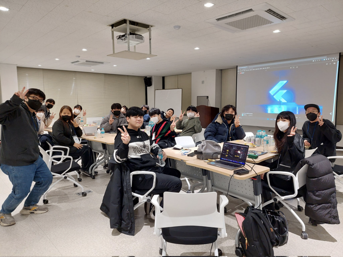
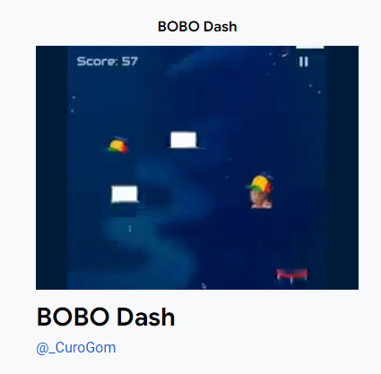

# 2회 (1/02 ~ 1/20) 1/20 발행예정

안녕하세요? 플러터 서울 커뮤니티의 홍종표(HDD)입니다.

달력을 보니 벌써 2월이 되었네요. 올해첫 플러터서울의 뉴스레터를 발행합니다.  

올해도 건강 조심하시고 2023년 계묘년 더 크게 성장할 수 있는 한해 되셨으면 좋겠습니다. 새해 복 많이받으세요. 

플러터 서울 커뮤니티에서는 **플러터와 관련된, 플러터 개발자를 위한 플러터 소식**들을 수집해서 2주 ~ 4주의 텀을 가지며 정기적으로 뉴스레터를 발행할 계획입니다.

많은 관심 가져주시면 감사하겠습니다. 🙇‍♂️

---

### 1. `Flutter Forward Viewing Party` 행사가 개최 되었습니다.

edit by 홍종표(HDD), 박제창

1월 25일 수요일 오후 11시 케냐 나이로비에서 개최되는 Flutter Forward 행사의 로컬 커뮤니티 같이보기 행사입니다!
Flutter 최신 소식을 함께 나누고 활동사진을 #FlutterForward 해쉬태그와 함께 SNS에 게시하는 활동도 진행 되었습니다.
그리고 간단한 간식과 라이브 키노트와 함께 실시간 번역(간단 번역)이 제공되었습니다. 

저녁 늦은 시간에도 불구하고 플러터에 관심을 가진분들이 많이 참석해 주셨습니다. 다시 한번 참석해주신 모든 분들께 감사 인사드립니다.  
****

[Flutter Seoul on Twitter: "#FlutterForward #FlutterSeoulLive Viewing Party pic.twitter.com/4TGw3WwbTl / Twitter"](https://twitter.com/flutterseoul/status/1618253574932430848?s=61&t=1lvvhkp7LX_b-JT8sVoYCA)

플러터 서울 공식 트위터: [@FlutterSeoul](https://twitter.com/flutterseoul?s=21&t=1lvvhkp7LX_b-JT8sVoYCA)

---

### 2. (Braking News) Flutter 3.7 Release

edit by CuroGom

Flutter의 2023년도 첫 Stable release인 3.7이 업데이트 되었습니다.

3.7에서도 여러 커뮤니티들의 지원으로 많은 기능의 업데이트도 이루어졌고,
특히 소문이 무성했던 신규 엔진 Impeller를 비롯, 업데이트 단골 손님 Devtools와 
Faster rendering 등 퍼포먼스에 대한 업데이트도 같이 이루어졌습니다.

자세한 내용은 하단의 별도 문서를 참고하시면 좋을 것 같습니다.

[Flutter 3.7 Release](https://www.notion.so/Flutter-3-7-Release-9cbf6e16c8f1438ca0ca4637b9e70a38)

---

### 3. `17 Days Of Flutter`가 진행되었습니다.

edit by 홍종표(HDD), 박제창, Curogom

[Flutter Forward](https://flutter.dev/events/flutter-forward#17-days-of-flutter)

- [https://flutter.dev/events/doodle-dash-challenge](https://flutter.dev/events/doodle-dash-challenge)
- [doodle-dash-challenge](https://flutter.dev/events/doodle-dash-challenge)에 플러터 서울의 CuroGom님께서 만드신 게임이 업로드되었어요. 소감한 말씀 부탁드립니다.
    - CuroGom
    전 단지 주어진 소스에 에셋만 갈아끼웠을 뿐인데…
    선정이 되었단 말에 너무 놀랐고,
        
        특히 이번 코드랩을 진행 하면서, 평소 게임에 관심이 많았어서
        게임에서 동작하는 화면 / 요소들에 대해 어떻게 코딩하면 좋을지 구상만 했었는데,
        이번 기회에 그런 부분이 많이 해소된 듯 합니다.
        
        간단한 게임 구현을 꿈꿔오신 분들이 계시다면, 
        이번 코드랩은 정말 좋은 기회라 자신있게 말씀 드릴 수 있습니다.
        
        [Day 1 - Build a game with Flutter and Flame](https://www.notion.so/Day-1-Build-a-game-with-Flutter-and-Flame-635371f7a14c4012a91022d7b9c2a5b8)
        

---

### 4. Flutter Package & Plugin 소식들

edit by 홍종표(HDD), 박제창 

**4-1. Flutter Webview 4.0 업데이트 소식**

- `Webview`에 설정하던 내용들 대부분을 `WebviewController`에 설정하도록 변경
- Exposes `WebResourceErrorType` from platform interface
- 최소 플러터 버전 3.0.0 이상 지원
- 2월 2일 기준: 버전 4.0.2

[webview_flutter | Flutter Package](https://pub.dev/packages/webview_flutter)

**4-2. go_router 6.0 업데이트 소식**

go_router_builder

- `redirect` 와 `build` 메소드의 파라미터가 `BuildContext context, GoRouterState` 로 변경
- `buildPageWithState` 메소드 명이 `buildPage` 로 변경

go_router

- `replace` 및 `replaceNamed` 메소드가 각각 `pushReplacement` , `pushReplacementNamed` 로 변경
- 2월 2일 기준: 6.0.2

[go_router | Flutter Package](https://pub.dev/packages/go_router)

- [6.0.0 마이그레이션 가이드](https://docs.google.com/document/d/1CMJwd5Moq_scvHf-trRldy9RW5MU7_Y8IB1aTrny-6s/edit)

**4-3. flutter_adaptive_scaffold 0.1.0**

구글 Material 3 디자인 지침(가이드라인)에 따른 적응형 Scaffold 위젯 구현을 돕는 패키지를 소개합니다.  

- 최초 릴리즈 2022년 9월 14일
- 2월 2일 기준: 0.1.0

[flutter_adaptive_scaffold | Flutter Package](https://pub.dev/packages/flutter_adaptive_scaffold)

**4-4**. ****Firebase Remote Config (Package of the Week)****

영상 보러가기: [https://youtu.be/34ExOdNEMXI](https://youtu.be/34ExOdNEMXI)

**4-5.** ****Flame (Package of the Week)****

영상 보러가기: [https://youtu.be/tEqVyJNOroI](https://youtu.be/tEqVyJNOroI)

### 4. Flutter 2022 Roadmap은 과연 어떻게 되었는가?

edit by 홍종표(HDD), CuroGom, 박제창 

작년 (2022년) 플러터 로드맵은 잘 이행되었을까요? 

한번 돌아보는 시간을 가져보았습니다. 모든 것을 포함하지는 못 햇지만 많은 이슈들이 수정되었어요. 그리고 데스크톱 플랫폼을 모두 지원하고자하는 플러터팀의 목표를 이루었어요. 
데스크톱 플랫폼을 모두 지원하는 것으로 진정한 멀티 플랫폼 프레임 워크가 되었습니다.

⚠  개발자 경험: 주관적 

✅  데스크톱: 전 플랫폼 지원 (Windows, macOS, Linux)

🚧  웹 (계속 진행중)

🚧  프레임워크와 엔진: [Material 3](https://m3.material.io/) 점진적지원 (진행중)

🚧  다트

🚧  Jank 이슈 : 신규 렌더링 엔진 Impeller 개발 (계속 진행중)

✅  계획된 지원 중단 - 32bit ios

[[Archive] Old Roadmaps](https://github.com/flutter/flutter/wiki/%5BArchive%5D-Old-Roadmaps#2022)

---

### 5. Android Studio ****Electric Eel****

edit by 박제창

Flutter 개발에 어떤 IDE를 사용하고 계신가요? 가장 대표적으로 Android Studio, Visual Studio Code를 사용하곤 합니다. 이번 2023년 1월 12일 Android Studio Electric Eel 버전이 정식 출시되었습니다.

새로운 Electric Eel 버전의 내용은 [아래의 영상](https://youtu.be/bVt14IBv4NA) 또는 [공식 블로그](https://android-developers.googleblog.com/2023/01/android-studio-electric-eel.html)를 참고해주세요.

---

**Flutter Seoul 뉴스레터 구독하기**

Flutter Seoul 의 뉴스레터 구독을 원하시는 분들은 해당 레포지터리의 `watch` 눌러 구독하실 수 있습니다.

👉  [플러터 이슈 기고란](https://docs.google.com/forms/d/1P58z7f_YC-BJehHW3xa2dp1impmFwrmEhOJUTDVfWPo/edit)

👉  [플러터 뉴스레터 2회 피드백](https://docs.google.com/forms/d/1A55EWMx1qGsmiVAfJ9bqVS8FG1hlgxT_Gn5C9C9F-Sw/edit)

---

플러터 서울 공식 트위터: [@FlutterSeoul](https://twitter.com/flutterseoul?s=21&t=1lvvhkp7LX_b-JT8sVoYCA)

플러터 서울 공식 디스코드: [https://flutter-seoul.com](https://flutter-seoul.com)

플러터 서울 공식 밋업: [https://meetup.flutter-seoul.com](https://meetup.flutter-seoul.com)