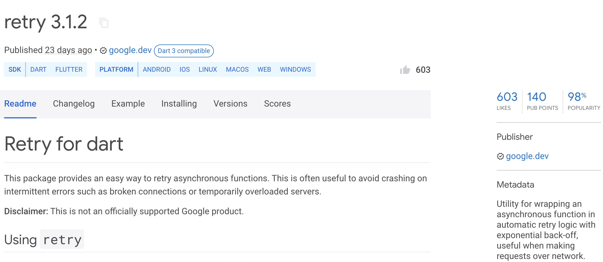
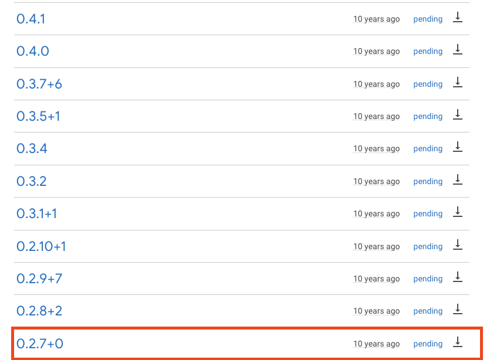
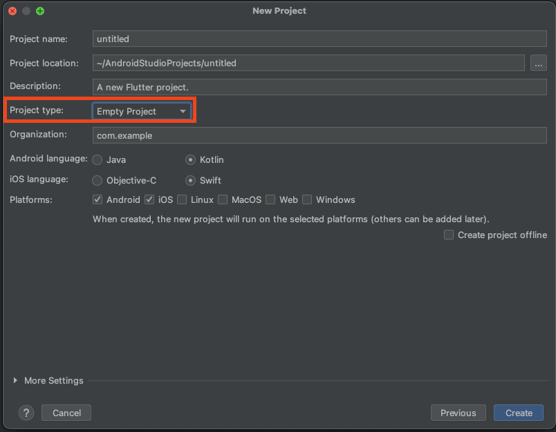
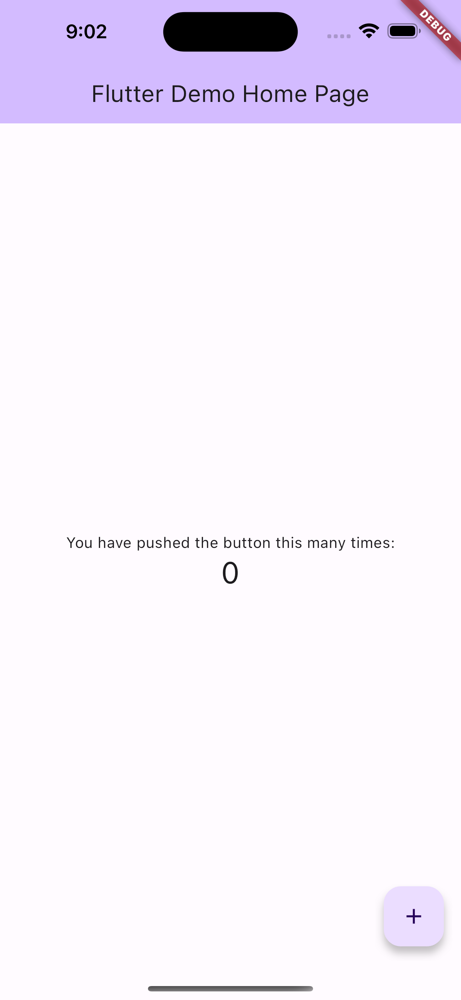

# Flutter Seoul Newsletter 5호

안녕하세요? 플러터 서울 커뮤니티의 홍종표(HDD), 박제창(Dreamwalker)입니다. 

벌써 한 여름의 날씨가 되었습니다. 한달만에 플러터 소식을 가지고 돌아왔습니다.  

우리 모두 2023년 무더운 여름도 잘 극복해 보아요. 

# 1. Google I/O 행사가 개최되었습니다.

2023년 5월 10일(현지시간) Google I/O를 기반으로 Flutter 3.10의 출시를 발표했습니다. 이번 릴리스도 Flutter의 개발자 경험을 향상시키고 그래픽 성능을 개선하며 웹, 데스크톱 및 모바일에서의 통합을 향상시키는 데 중점을 두었으며 WASM, Impeller등 다양한 주제로 발표가 되었습니다. 

더 자세한 내용들은 아래의 유튜브 내용을 확인해보세요.

[Flutter 유튜브 플레이리스트 보러가기](https://youtube.com/playlist?list=PLjxrf2q8roU1523hIgnNX4r6ukX72QYLg)

# 2. 플러터 SDK 및 패키지 소식

## 2.1 Flutter SDK 3.10 버전 출시

이번 Google I/O에서 3.10 버전이 출시되었습니다. 현재는 (2023.06.09 기준) 3.10.4 버전으로 업데이트 되었습니다. 빠르게 마이너하게 변경되고 있어서 체크는 필수! 

👉 [Whats New in Flutter 3.10](https://medium.com/flutter/whats-new-in-flutter-3-10-b21db2c38c73)

👉 [변경내역 보러가기](https://github.com/flutter/flutter/wiki/Hotfixes-to-the-Stable-Channel)

## 2.2 GoRouter 8.0.1

**`go_router`** 패키지는 Flutter에서 라우팅을 처리하는 데 사용되는 인기 있는 패키지 중 하나입니다. 사용자 인터페이스 간의 전환 및 네비게이션을 관리하기 위해 라우팅 시스템을 구축하는 데 도움이 됩니다. 이 패키지는 일반적으로 간단하고 직관적인 API를 제공하여 라우팅을 구성하고 관리하는 데 용이한 패키지입니다. 

게다가 7.1.0 많은 사람들이 기대했던 `StatefulShellRoute` 가 나와서 MultiRouteStack 앱을 쉽게 구현할 수 있도록 변경되었습니다.

👉 [StatefulShellRoute Example 보러가기](https://github.com/flutter/packages/blob/main/packages/go_router/example/lib/stateful_shell_route.dart)

마이그레이션 가이드 

👉 [GoRouter 8.0.0 Migration Guide 보러가기](https://docs.google.com/document/d/1VCuB85D5kYxPR3qYOjVmw8boAGKb7k62heFyfFHTOvw/edit)

GoRouterBuilder 2.1.0

[go_router_builder | Dart Package](https://pub.dev/packages/go_router_builder)

## 2.3. **retry**

**`retry`**는 Flutter에서 HTTP 요청 또는 비동기 작업을 재시도하는 데 사용되는 패키지입니다. 이 패키지를 사용하면 네트워크 요청이 실패하거나 예외가 발생했을 때, 자동으로 요청을 재시도할 수 있습니다. 이는 네트워크 연결이 불안정하거나 서버에서 임시적인 문제가 발생할 때 유용합니다.

**`retry`** 패키지의 주요 기능은 다음과 같습니다:

1. 재시도 로직 구성: **`retry`** 패키지는 재시도 동작을 구성하는 데 사용되는 다양한 매개변수와 옵션을 제공합니다. 최대 재시도 횟수, 재시도 간격, 지수적 백오프, 재시도 조건 등을 설정하여 재시도 동작을 세밀하게 제어할 수 있습니다.
2. 재시도 정책 지정: 패키지는 성공적으로 완료된 요청과 재시도해야 하는 실패한 요청을 구별하는 재시도 정책을 지원합니다. 예를 들어, 5xx 서버 오류를 받은 경우에만 재시도하도록 설정할 수 있습니다.
3. 예외 처리: 패키지는 예외 처리를 위한 콜백 함수를 제공하여 재시도 중에 발생한 예외를 처리할 수 있습니다. 예외 유형, 최대 예외 수 등을 설정하여 예외 처리 동작을 구성할 수 있습니다.
4. 비동기 작업 지원: **`retry`** 패키지는 비동기 작업에도 적용할 수 있습니다. HTTP 요청 외에도 다른 비동기 작업을 재시도하는 데 사용될 수 있습니다.

**`retry`** 패키지는 안정적인 네트워크 요청 및 비동기 작업을 위한 강력한 도구로 사용될 수 있습니다. 실패에 강건한 애플리케이션을 구축하고 네트워크 문제를 처리하는 데 도움이 되는 패키지입니다.

👉 [https://pub.dev/packages/retry](https://pub.dev/packages/retry) 



## 2.4 matcher

[matcher | Dart Package](https://pub.dev/packages/matcher)

Dart의 matcher 패키지는 테스트를 작성할 때 유용한 도구입니다. 테스트를 작성할 때 matcher 패키지를 사용하면 테스트 코드를 더 명확하고 간결하게 작성할 수 있습니다.

matcher 패키지는 다양한 유형의 matcher를 제공합니다. 예를 들어, matcher 패키지는 값이 특정 값과 일치하는지 확인하는 matcher를 제공합니다. 또한 matcher 패키지는 값이 특정 조건을 충족하는지 확인하는 matcher도 제공합니다.

matcher 패키지를 사용하면 테스트 코드를 더 명확하고 간결하게 작성할 수 있습니다.

## 2.5 http

Flutter의 http 패키지는 Flutter 애플리케이션에서 HTTP 요청을 보내고 응답을 처리하는 데 사용되는 패키지입니다. http 패키지는 2023년 6월 8일에 1.0 버전으로 출시되었습니다.



[http | Dart Package](https://pub.dev/packages/http)

# 3. MediaQuery 변경사항

`MediaQuery`를 `InheritedModel`로 사용하여 앱 성능향상의 큰 잠재력을 제공합니다.

`MediaQuery`를 통해 원하는 부분만 청취해서 위젯의 rebuild를 줄여줄 수 있습니다. 

👉 [참고 블로그 보러가기](https://itnext.io/the-most-important-flutter-3-10-feature-that-nobody-talks-about-1cc575a6063f)

# 4. Dart 코드랩

Dart3이 되면서 Patterns과 Records가 추가되었는데요. 새로운 문법들이 추가되어서 많은 분들이 어려움을 겪으시는거 같았어요. 쉽게 배워볼 만한 코드랩을 하나 추천합니다. 

👉 [코드랩 링크](https://codelabs.developers.google.com/codelabs/dart-patterns-records?hl=ko#0) 

- Dart의 패턴과 레코드에 대한 코드랩은 Google Codelabs에서 제공합니다. 이 코드랩에서는 Dart의 패턴과 레코드에 대한 개념을 소개하고, 이를 사용하여 실제 문제를 해결하는 방법을 보여줍니다. 코드랩은 다음과 같은 내용을 다룹니다.
    - Dart의 패턴과 레코드에 대한 개념
    - 패턴과 레코드를 사용하여 실제 문제를 해결하는 방법
    - 패턴과 레코드의 장점과 단점
- 코드랩은 Dart를 처음 접하는 사용자도 쉽게 따라할 수 있도록 설계되었습니다. 코드랩을 완료하면 Dart의 패턴과 레코드에 대한 기본적인 이해를 얻을 수 있습니다.

# 5. Flutter EmptyProject 및 기본 Project 변경

## 5.1 Flutter EmptyProject

```bash
// 명령어
flutter create -e <프로젝트 명>
```



```dart
// main.dart
import 'package:flutter/material.dart';

void main() {
  runApp(const MainApp());
}

class MainApp extends StatelessWidget {
  const MainApp({super.key});

  @override
  Widget build(BuildContext context) {
    return const MaterialApp(
      home: Scaffold(
        body: Center(
          child: Text('Hello World!'),
        ),
      ),
    );
  }
}

// pubspec.yaml
name: untitled
description: A new Flutter project.
publish_to: 'none'
version: 0.1.0

environment:
  sdk: '>=3.0.1 <4.0.0'

dependencies:
  flutter:
    sdk: flutter

dev_dependencies:
  flutter_test:
    sdk: flutter
  flutter_lints: ^2.0.0

flutter:
  uses-material-design: true
```

**🚧 주의**

**쿠퍼티노 아이콘이 pubspec에 들어가지 않으며, 테스트 폴더가 자동으로 생성되지 않습니다.**

## 5.2 Flutter 기본 Project  Material 3 적용

플러터 기본 프로젝트는 이제 Material 3로 생성됩니다.

```dart
class MyApp extends StatelessWidget {
  const MyApp({super.key});

  // This widget is the root of your application.
  @override
  Widget build(BuildContext context) {
    return MaterialApp(
      title: 'Flutter Demo',
      theme: ThemeData(
        colorScheme: ColorScheme.fromSeed(seedColor: Colors.deepPurple),
        useMaterial3: true,
      ),
      home: const MyHomePage(title: 'Flutter Demo Home Page'),
    );
  }
}
```



# 6. ****Goodbye to Tim****

그동안 Flutter 팀의 PM의 역할을 담당하셨던 Tim Sneath가 구글을 떠난다는 소식입니다. Sneath는 Flutter 팀에서 4년 동안 근무했으며, Flutter 프로젝트의 성장에 큰 기여를 했습니다. 비록, Flutter 팀에서 떠나지만, Flutter 커뮤니티와 계속해서 소통할 것이라고 밝혔습니다. Sneath의 헌신과 노력에 감사드립니다.

👉 [Tim Sneath 작별인사 글 보러가기](https://timsneath.medium.com/a-fond-farewell-to-flutter-and-dart-7a7a8c7c03e2)

---

**Flutter Seoul 뉴스레터 구독하기**

Flutter Seoul 의 뉴스레터 구독을 원하시는 분들은 해당 레포지터리의 `watch` 눌러 구독하실 수 있습니다

---

플러터 서울 공식 트위터: [@FlutterSeoul](https://twitter.com/flutterseoul?s=21&t=1lvvhkp7LX_b-JT8sVoYCA)

플러터 서울 공식 디스코드: [https://flutter-seoul.com](https://flutter-seoul.com)

플러터 서울 공식 오픈 카카오톡: [참여하기](https://open.kakao.com/o/gdL2Gj1e)

플러터 서울 공식 밋업: [https://meetup.flutter-seoul.com](https://meetup.flutter-seoul.com)