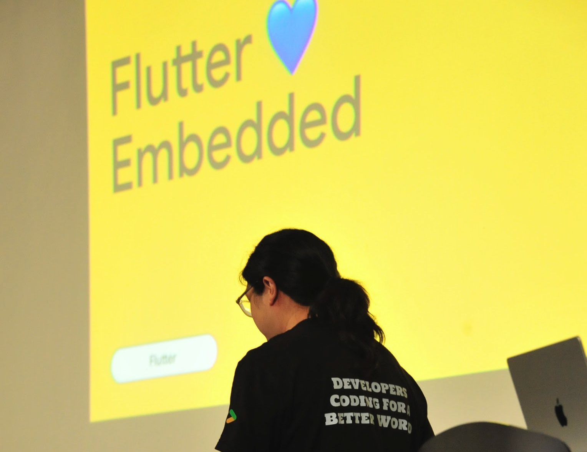
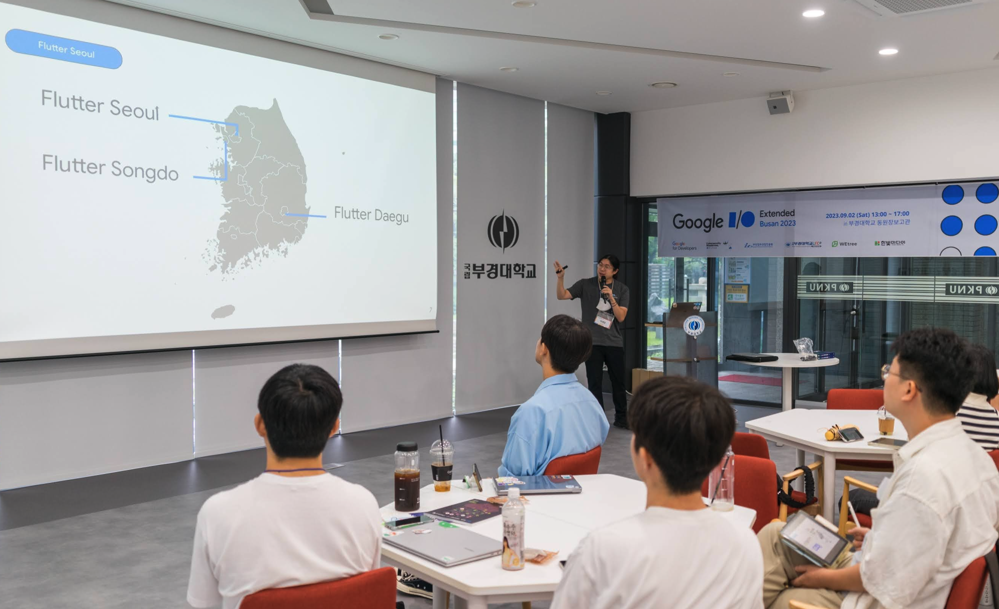

# Flutter Seoul Newsletter 6호

---

안녕하세요? 플러터 서울 커뮤니티의 홍종표(HDD), 박제창(Dreamwalker)입니다. 

7, 8월의 무더운 여름 날씨에 늘어져 여름이 다 지나가서야 뉴스레터 6호를 발간하게 되었습니다.

재 충전의 시간을 가졌으니 앞으로의 뉴스레터 더 알차게 준비해보도록 하겠습니다.

곧 추석이니 다들 화목하고 행복한 9월 되시면 좋겠습니다.

이번 뉴스레터에는 경품 🎁 이 걸려있는 설문조사가 있습니다. 많은 참여 부탁드립니다. 🙇‍♂️

---

## 1. Flutter 3.13 및 Dart 3.1 업데이트 소식

Flutter 3.13 버전은 Flutter의 성능, 기능, 호환성을 개선하는 데 중점을 두었습니다. 특히 iOS 성능 개선은 Flutter 앱의 성능을 크게 향상시킬 것으로 기대됩니다. 또한, 폴더블 장치 지원 개선, 광역 색상 지원, Material 3 업데이트 등 최신 트렌드에 맞는 기능도 추가되었습니다. 

현재는 3.13.3 버전이 안정화 버전으로 출시되어 사용가능합니다. 

- 8월 17일 - Flutter 3.13 및 Dart 3.1 버전이 출시
- 8월 24일 - 3.13.1 업데이트
- 8월 31일 - 3.13.2 업데이트
- 9월 9일 - 3.13.3 업데이트

### 1-1. 업데이트 내용 요약

### 프레임워크

- OCR 텍스트 필드 문자 인식
- showAdaptiveDialog, AdaptiveDialog 를 통해 플랫폼에 맞는 적응형 대화상자 사용 가능

### 앱 라이프 사이클

- 종료를 감지할 수 있는 AppLifeCycleListener 추가

### 스크롤링

- 2D 스크롤 기능이 개선되었습니다.
- 새 슬리버 위젯들이 추가되었습니다.

자세한 내용은 플러터 공식 미디움 블로그를 확인해주세요.

👉 **[What’s new in Flutter 3.13](https://medium.com/flutter/whats-new-in-flutter-3-13-479d9b11df4d)**

👉 **[Dart 3.1 & a retrospective on functional style programming in Dart 3](https://medium.com/dartlang/dart-3-1-a-retrospective-on-functional-style-programming-in-dart-3-a1f4b3a7cdda)**

### 1-2. iOS 16.6 이슈 관련 내용(CuroGom님)

Flutter 3.10.6 버전에서 [iOS 16.6 관련 심각한 성능 이슈](https://github.com/flutter/flutter/issues/131319)가 발생해 3.13에서 수정되었다고 합니다.

다만 버전 올릴 준비가 안된 경우를 위해 [3.10.7 버전](https://github.com/flutter/flutter/wiki/Upgrading-from-3.10.6-to-3.10.7)으로 올리는 것으로도 해결할 수 있다고 합니다. 

## 2. 지나간 플러터 관련 행사들

### 2-1. 7월 29일 (토) **Google I/O Extended Seoul**

장소: 코엑스 컨퍼런스룸(남) 4F

일시 : 2023년 07월 29일 (일) 오후 01:00 - 오후 05:00

주최: GDG SEOUL

Google Cloud, Tensorflow, Android, Flutter, Go등 구글 기술들에 대한 다양한 세션이 진행되었습니다.

로비 공간에는 다양한 액티비티 부스들도 있어서 즐거운 시간을 보낼 수있었습니다.

행사 당일에는 플러터 서울의 박제창 님이 연사로 참석해 주셨습니다.

- 박제창님 : [**Flutter Google I/O 2023 Recap**](https://speakerdeck.com/itsmedreamwalker/o-extended-2023-seoul)

### 2-2. 7월 30일 (일) **Flutter Developer Networking**

장소: 서울 광진구 아차산로34길 32 블랙홀

일시 : 2023년 07월 30일 (일) 오후 01:00 - 오후 07:00

주최: Flutter Seoul

플러터 개발자들의 네트워킹 행사가 진행되었습니다. 
일요일이라서 다들 주류를 많이 드시진 못했지만 굉장히 즐거운 시간을 보냈습니다. 😁 

### 2-3. 8월 26일 (토) **Google I/O Extended Incheon**

장소: 인천 스타트업 파크

일시 : 2023년 08월 26일 (토) 오후 01:00 - 오후 07:00

주최: GDG INCHOEN

I/O extended 행사는 구글 I/O에서 발표한 기술과 지식들 나누는 자리입니다.

작년 데브페스트때 처럼 엄청나게 큰 규모의 행사로 Android, MachineLearning, Web, Flutter, Backend 까지!! 총 세션 28개의 어마어마한 행사가 열렸습니다.

행사당일 플러터 서울 운영진 3분이 연사자로 참여해주셨습니다. 

- 박제창님: [**Flutter 💙 Embedded**](https://www.notion.so/Flutter-Seoul-Newsletter-6-dc9c6c58f64c4011b44014c1bb0a9170?pvs=21)
    
    
    
- CuroGom님: [**Widgetbook 페이지에 Widget 스크랩하기**](https://www.notion.so/Flutter-Seoul-Newsletter-6-dc9c6c58f64c4011b44014c1bb0a9170?pvs=21)
    
    
    
- 송승현님: [**Debugging A to Z**](https://docs.google.com/presentation/d/1n0HOKMPeuY-hk35AMPH39VXybEIEXAvVSn4KdvO4sJY/edit?usp=sharing)
    
    
    

### 2-4. 9월 2일 (토) **Google I/O Extended Cloud Busan & Busan**

장소: 부경대학교 동원장보고관

일시 :2023년 09월 02일 (토) 오후 01:00 - 오후 05:00

주최: GDG Cloud Busan & Busan 

행사 당일에는 플러터 서울의 박제창 님이 연사로 참석해 주셨습니다.

- 박제창님 : [**Flutter Google I/O 2023 Recap Busan Edition**](https://speakerdeck.com/itsmedreamwalker/o-extended-2023-cloud-busan-and-busan)

## 3. 다가오는 플러터 행사

### 3-1. 9월 23일 (토)  **Flutter MeetUp - In Songdo**

장소: 송도 컨벤시아 115호

일시 : 2023년 09월 23일 (토) 오후 01:00 - 오후 07:00

주최: GDG Songdo

플러터 중상급 사용자들을 위한 밋업으로 총 8개의 다양한 플러터 관련 세션들이 진행됩니다.

추석 전 새로운 지식을 얻기 위한 특별한 시간에 참여해보세요~! 

👉 [Festa 링크](https://festa.io/events/3887)

플러터 서울의 운영진 분들이 대거 출격합니다. 

- CuroGom님: **심사를 피하는 양날의 부리, ShoreBird**
- 박제창님: **Custom Painter**
- 송승현님: **플러터로 설명하는 WebSite와 WebApp의 차이**

## 4. FlutterCon 영상 공개(CuroGom님)

FlutterCon은 함께 올해 가장 큰 플러터 개발자 행사라고 할 수 있을만큼 큰 규모의 행사였습니다.

해당 행사에서 진행되었던 세션의 영상들이 공개되었다고 합니다.

[실력 쑥쑥 보러가기 🆙 👍](https://www.droidcon.com/content/?filter_postyear=2023&filter_post_event_tag=fluttercon)

## 5. TMAP - Flutter Navi SDK 지원(오기환님)

[T Map Navi SDK 링크](https://tmapapi.sktelecom.com/main.html#androidFlutter/guide/androidGuide.sample8)

티맵에서 Flutter SDK를 제공한다고 합니다. 
Flutter용 SDK를 지원하는 회사가 점점 많아지는 것 같아 기쁘네요!

## 6. 8월의 Medium 게시물(발라스님)

플러터 서울의 발라스님께서 모아 추천해주신 블로그 글들입니다. 🙇‍♂️

굉장히 좋은 내용들이 많은 글들이었습니다. 👍

### 6-1 초심자용

1. **[Top 10 Flutter Apps You Must Make as a Beginner](https://shirsh94.medium.com/top-10-flutter-apps-you-must-make-as-a-beginner-351ba913133f)**
2. **[How to setup a logging system in Flutter with Talker](https://angeloavv.medium.com/how-to-setup-a-logging-system-in-flutter-with-talker-45577688e54e)**
3. **[Responsive layouts in Flutter: Techniques and Best Practices](https://medium.com/@sharonatim/building-responsive-layouts-in-flutter-ea329c3637d3)**

### 6-2 중급자 이상

1. **[Flutter Widget Lifecycle](https://levelup.gitconnected.com/flutter-widget-lifecycle-33cb67459d0)**
2. **[Offline First Approach With Flutter](https://medium.com/codebrew/offline-first-approach-with-flutter-ace2843d36d8)**
3. **[Flutter Custom Theme with ThemeExtension + Templates](https://medium.com/@alexandersnotes/flutter-custom-theme-with-themeextension-792034106abc)**

### 6-3 오픈소스

**[Top 12 Flutter Open source projects](https://medium.com/@sahaj.blup/top-12-flutter-open-source-projects-c27fd21fdad9)**

## 7. ****The TensorFlow Lite Plugin for Flutter is Officially Available****

👉 [기사 보러가기](https://blog.tensorflow.org/2023/08/the-tensorflow-lite-plugin-for-flutter-officially-available.html) 

- TensorFlow Lite는 모바일 및 임베디드 기기에서 머신 러닝을 가속화하는 오픈 소스 라이브러리 입니다.
- 2023년 8월 18일, [TensorFlow Lite Flutter](https://pub.dev/packages/tflite_flutter) 플러그인이 공식적으로 Google GitHub 계정으로 이전되고 출시되었습니다.
- 이로써 Flutter에 TensorFlow Lite 모델을 Flutter 앱에 더 쉽게 통합할 수 있게 되었습니다.

## **[Flutter Seoul X 라인개발실록] 라인 Flutter 개발자에게 물어보세요(~9/25)**

라인에서는 Flutter를 활발하게 사용하고 있다는 사실 알고 계셨나요? 라인에서는 2020년 일본의 No.1 배달 서비스 'Demaecan(데마에칸)'을 인수했습니다. 이후 라인의 ABC Studio에서는 데마에칸(出前館)의 일부 앱을 Flutter를 도입해 다시 만들었어요. 

현재 배송원 앱, 드라이버 앱 등 다양한 클라이언트 개발이 Flutter로 이뤄지고 있습니다. [라인개발실록](https://www.youtube.com/@linedevlog)에서 ABC Studio의 Flutter 개발자와 이야기를 나눠봅니다. 이 폼에 여러분이 궁금한 점을 남겨주세요. 

9월 25일 자정까지 사전 질문을 남겨주신 분들께는 추첨을 통해 **LINE DEV 미니니 스티커**를 드립니다!

### ABC Studio의 **Flutter 개발자 3인방**

- 김종식 님
- 박연호 님
- 박유진 님

### **ABC Studio 알아보기**

일본의 국민 배달앱 데마에칸을 만드는 ABC Studio가 궁금하다면 아래 글과 영상을 확인해 보세요.

- 블로그 | [Android 신입 개발자, Flutter로 기술 전환 가보자고](https://engineering.linecorp.com/ko/blog/flutter-onboarding-for-new-employees/)
- 블로그 | [Flutter 인기 아키텍처 라이브러리 3종 비교 분석 - GetX vs BLoC vs Provider](https://engineering.linecorp.com/ko/blog/flutter-architecture-getx-bloc-provider/)
- 블로그 | [멀쩡한 앱을 Flutter 앱으로 다시 짠 이유 - 일본 1위 배달 앱, 두 번째 Recode](https://engineering.linecorp.com/ko/blog/demaecan-2nd-recode-kmm-to-flutter/)
- 블로그 | [Flutter 패키지로 공통 모듈 리팩토링하기](https://engineering.linecorp.com/ko/blog/common-module-refactoring-with-flutter-package/)
- 유튜브 | [일본 국민 배달앱을 한국에서 만든다고? I ABC Studio I LINER:VIEW](https://youtu.be/lTEn8KgVwNc?si=qRfNhorBy_hQd--U)

### 참여링크

링크: [https://feedback.line.me/enquete/public/21544-fqeSQ18B](https://feedback.line.me/enquete/public/21544-fqeSQ18B)

---

**Flutter Seoul 뉴스레터 구독하기**

Flutter Seoul 의 뉴스레터 구독을 원하시는 분들은 해당 레포지터리의 `watch` 눌러 구독하실 수 있습니다

---

플러터 서울 공식 트위터: [@FlutterSeoul](https://twitter.com/flutterseoul?s=21&t=1lvvhkp7LX_b-JT8sVoYCA)

플러터 서울 공식 디스코드: [https://flutter-seoul.com](https://flutter-seoul.com)

플러터 서울 공식 오픈 카카오톡: [참여하기](https://open.kakao.com/o/gdL2Gj1e)

플러터 서울 공식 밋업: [https://meetup.flutter-seoul.com](https://meetup.flutter-seoul.com)